# Modus_X 2.1: Coordinated Dual Memory and Matched Language Scaling

Sanyam Chaudhary  
Independent Researcher, India  
Modus Research Project, July 2026

## Abstract

We present **Modus_X 2.1**, an experimental causal sequence-model family that coordinates bounded associative matrix memory with recurrent vector computation. The architecture retains fixed recurrent state for a fixed configuration: unlike a Transformer key-value cache, its recurrent state does not append one entry per generated token. This property does not by itself imply lower total compute, latency, or memory on every workload, but it creates a distinct systems path for long-context inference.

The release retains the complete v1.1.1 evidence lineage and adds two v2 leads. **MemoryFeedbackArchive** is the language-modeling lead: retrieved matrix context is compressed and conservatively gated back into the vector computation. At approximately 47M parameters and 102.4M processed enwik8 characters, it improves matched dense validation BPC from **1.4850 to 1.4597** and dense test BPC from **1.4927 to 1.4650** relative to CurrentArchive. At the same 102.4M-character endpoint, scaling MemoryFeedbackArchive from 47.44M to 81.49M parameters improves dense test BPC to **1.4439**; a further increase to 99.44M reaches **1.4420** test BPC but slightly regresses validation. After matched late annealing, the promoted 81.49M checkpoint reaches **1.3824** dense test BPC at 163.84M characters, narrowly improving the published v1.1.1 endpoint with fewer parameters while remaining behind official Mamba.

**CurrentArchiveDelta** is the controlled-memory lead. At equal constrained recurrent-state bytes it substantially outperforms the tested Transformer with a truncated KV window on mixed clean/update retrieval, while a full-context Transformer KV baseline wins when its cache can retain the entire context. The combined evidence therefore identifies a state-budget crossover, not universal Transformer inferiority. Official Mamba still wins the available matched dense enwik8 comparison; the 1.1 BPC target and trained 1B quality remain open. Modus_X 2.1 is presented as a calibrated research line: coordinated bounded memory improves the tested recurrent language model, and a separate current/archive mechanism demonstrates useful versioned storage under constrained state. No trained checkpoint yet owns both leads.

---

## 1. Introduction

Causal autoregressive language modeling is dominated by the Transformer architecture introduced by Vaswani et al. [1]. Standard dense self-attention has two important scaling properties:
1. **Quadratic attention work**: the attention interaction itself scales as $O(L^2)$ with sequence length $L$, although optimized kernels, sparse patterns, and bounded windows can materially change practical cost.
2. **Linear inference-state growth**: ordinary autoregressive decoding stores key and value projections in a KV cache whose size grows as $O(L)$. Quantization, grouped-query attention, eviction, and compression reduce the coefficient but do not remove the dependence on retained context length.

To address these limitations, recent research has focused on recurrent and linear-time architectures with bounded inference state, including structured state-space models such as S4 [2] and Mamba [3], linear-attention and fast-weight formulations [4, 5, 6], and recurrent alternatives such as RetNet and RWKV [7, 8]. These models do not share one universal weakness. However, controlled recall studies show that finite recurrent state can suffer capacity and interference failures on multi-query associative recall even when ordinary language loss remains competitive [16]. Delta-rule matrices, gated linear attention, recurrent memory, and attention-recurrence hybrids attack different parts of this problem [13, 17-22].

In this paper, we present **Modus_X**, a dual-memory recurrent architecture extending the prior Modus line of matrix-memory models [11]. Version 1 placed an associative matrix stream and a selective vector stream inside each layer and combined their outputs through an input-dependent router. Version 2 asks a stricter question: can retrieved matrix content change what the vector recurrence computes, rather than merely contribute a second late-fused output?

### 1.1 Contributions

This release makes four bounded contributions:

1. **CurrentArchiveDelta**, a fixed-state, two-timescale associative memory with shared addressing but independently gated current and archive updates.
2. **MemoryFeedbackArchive**, a coordinated variant that compresses retrieved matrix context and gates it into the vector-stream input before the recurrent update.
3. **Causal evidence across separate lanes**: matched dense byte-language evaluation for matrix-to-vector feedback, and equal-state controlled retrieval for current/archive storage, including negative controls and rejected corrections.
4. **A reproducible systems path**: exact parameter/state accounting plus bounded TPU update, checkpoint, and restore gates for a frozen one-billion-parameter configuration, without claiming trained 1B quality.

### 1.2 From v1.1.1 to v2.1

| Research element | v1.1.1 | v2.1 change | Evidence status |
|---|---|---|---|
| Matrix/vector interaction | Parallel streams with late routed fusion | Retrieved matrix context conditions recurrence before the vector update | **Measured v2:** MemoryFeedbackArchive |
| Associative state | One principal matrix timescale | Shared-address current and archive matrices with separate write timescales | **Measured v2:** CurrentArchiveDelta |
| Generic-language lead | Published v1.1.1 endpoint | 81.49M MemoryFeedback endpoint at matched characters | **Measured v2**, one seed |
| Controlled-memory lead | Published recall/overwrite evidence | Mixed clean/update, distractor, and equal-state crossover protocols | **Measured v2**, three seeds |
| One-billion-parameter path | Parameter proposal | Exact systems and restore smokes; MemoryFeedback tree counted separately | **Systems evidence**, not quality |

The two v2 branches answer different questions. **MemoryFeedbackArchive is the
language lead. CurrentArchiveDelta is the bounded-storage and update lead.**
No experiment in this release demonstrates that one checkpoint simultaneously
owns both advantages.

### 1.3 Novelty boundary

The atomic ingredients are not claimed as individually new. Fast weights, delta-rule updates, gated linear attention, recurrent long-term memory, and hybrids of recurrence with local or global attention all have substantial prior art [4-6, 13, 17-22]. Modus_X 2.1 contributes a particular coordination pattern: two fixed-size delta memories with distinct update timescales produce a mixed retrieval; a low-rank, scalar-gated projection of that retrieval conditions the input to the recurrent vector computation; and the mechanism is tested against its uncoordinated predecessor under matched language-model budgets. This differs from Kimi Delta Attention's channel-wise gated delta rule [19], Titans' neural long-term memory [18], and ARMT-style recurrent associative memory [21, 22]. The present evidence does not establish that this composition is globally superior to those architectures.

---

## 2. Architecture

Modus_X processes activations $x_1, x_2, \dots, x_L \in \mathbb{R}^d$. The published v1 baseline uses two parallel streams followed by late fusion. The v2 language lead preserves the bounded states and final router but adds an earlier causal connection: matrix retrieval modifies the normalized input consumed by the vector recurrence.

<div align="center">
    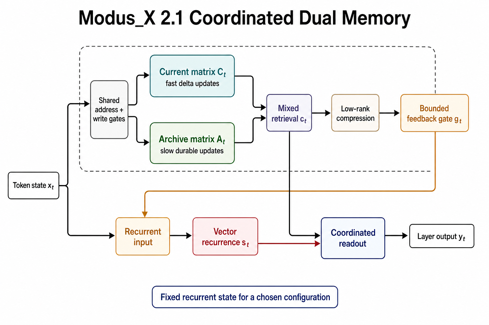
</div>

*Figure 1. The v2 causal information path. Current and archive matrices share
addressing but update at different timescales. Their mixed retrieval is
compressed and bounded before it modifies the input consumed by vector
recurrence. Matrix retrieval and vector state remain separate inputs to the
coordinated readout.*

### 2.1 Selective Vector Recurrence

The vector stream keeps a learned recurrent state inspired by selective state-space models [3]. It is not the official Mamba block. For each input $x_t$, learned retain, update, and output gates produce:

$$
s_t = \text{retain}_s(x_t) \odot s_{t-1} + \delta_s(x_t) \odot u_t
$$

$$\text{vector\_out}_t = \text{gate}_s(x_t) \odot \left(W_{p} \cdot s_t\right)$$

This path is efficient and well suited to continuous sequence tracking. It can carry local syntactic flow, recency, and smooth dynamics that do not need a full associative matrix write.

### 2.2 The Matrix Memory Stream (Modus)

The matrix stream keeps a fixed matrix state $H_t$. This is related to fast-weight and linear-attention views of sequence modeling [4, 5, 6], with a delta-rule overwrite mechanism inspired by DeltaNet-style associative updates [13]. Keys and queries address this state, while values define what should be written. The delta update writes only the residual between the desired value and what the key currently retrieves.

$$k_t = \text{normalize}(W_k x_t)$$
$$q_t = \text{normalize}(W_q x_t)$$
$$v_t = \tanh(W_v x_t)$$

$$H_t = \text{retain}_t \odot H_{t-1} + \eta_t \odot \text{write}_t \odot \left(v_t - H_{t-1} k_t\right) k_t^T$$

The retrieval is computed via content-addressed query projection:

$$\text{retrieved}_t = \text{read}_t \odot \text{LayerNorm}(H_t q_t)$$
$$\text{modus\_out}_t = \text{out}_t \odot \left(W_o \cdot [x_t ; \text{retrieved}_t]\right)$$

This update is content-addressed. It does not append a token to a cache. It changes a fixed memory according to the current key and value.

### 2.3 Gated Routing and Fusion

The router computes a token-dependent mixture:

$$y_t = r_t \cdot \text{modus\_out}_t + (1 - r_t) \cdot \text{vector\_out}_t$$

Modus_X does not statically choose matrix memory or vector recurrence. It lets the representation decide at each token and layer how much to use each memory path.

### 2.4 CurrentArchiveDelta

CurrentArchiveDelta replaces one matrix with two shared-address memories. The current matrix $C_t$ is intended to adapt rapidly, while archive matrix $A_t$ receives an additional learned write gate and independent retention:

$$
C_t = \rho^C_t C_{t-1}
    + \alpha_t \left(v_t - C_{t-1}k_t\right)k_t^T
$$

$$
A_t = \rho^A_t A_{t-1}
    + \alpha_t a_t \left(v_t - A_{t-1}k_t\right)k_t^T
$$

where $\alpha_t = \eta_t\,\text{write}_t$ and $a_t \in [0,1]$ is the archive-write gate. Both memories are queried with $q_t$. A learned token-dependent mixture $\mu_t$ forms the bounded context:

$$
c_t = \text{read}_t \left[
    \mu_t\,\mathrm{LN}(C_tq_t)
    + (1-\mu_t)\,\mathrm{LN}(A_tq_t)
\right].
$$

The mechanism has no explicit symbolic version index. "Current" and "archive" are functional interpretations tested by overwrite and retrieval diagnostics, not guaranteed semantics.

**Algorithm 1: CurrentArchiveDelta update and read**

```text
input: x_t, current matrix C, archive matrix A
k, q, v, write, read, archive_write <- projections(x_t)
C <- retain_current * C + write * (v - C k) k^T
A <- retain_archive * A + archive_write * write * (v - A k) k^T
current_read <- LayerNorm(C q)
archive_read <- LayerNorm(A q)
mu <- sigmoid(mix_projection(x_t))
c_t <- read * (mu * current_read + (1 - mu) * archive_read)
return C, A, c_t
```

### 2.5 MemoryFeedbackArchive

MemoryFeedbackArchive coordinates matrix and vector computation before the recurrent update. It applies a low-rank projection to the mixed matrix context:

$$
f_t = W_{\mathrm{up}}\tanh(W_{\mathrm{down}}c_t), \qquad
g_t = \sigma(w_g^T x_t + b_g),
$$

then changes the vector-stream input:

$$
\tilde{x}_t = \mathrm{LN}(x_t + g_t f_t).
$$

The vector recurrence in Section 2.1 consumes $\tilde{x}_t$, so retrieved memory can influence the next recurrent state. The final router remains in place; feedback is an additional causal coupling, not an independent output residual. In the measured 47M run, this change improves dense test BPC by 0.0277 over CurrentArchive at 0.85% more parameters and approximately 12.5% more research-code runtime.

**Algorithm 2: MemoryFeedbackArchive coordination**

```text
input: token state x_t, mixed matrix retrieval c_t, vector state s_(t-1)
feedback <- W_up tanh(W_down c_t)
gate <- sigmoid(w_g^T x_t + b_g)
recurrent_input <- LayerNorm(x_t + gate * feedback)
s_t, vector_out <- vector_recurrence(recurrent_input, s_(t-1))
matrix_out <- matrix_readout(c_t)
y_t <- coordinated_router(matrix_out, vector_out, x_t)
return s_t, y_t
```

### 2.6 State and compute

For matrix width $R$, CurrentArchive and MemoryFeedbackArchive retain two $R \times R$ matrices per layer plus vector state and fixed projections. Their recurrent state is $O(R^2 + R)$ and independent of processed sequence length. Per-token matrix update/read work remains $O(R^2)$ in the current implementation. Bounded state therefore does not imply constant total compute, production-kernel efficiency, or lower cost at every context length.

| Configuration | Parameters | Persistent matrix states/layer | Evidence role |
|---|---:|---:|---|
| CurrentArchive control | 47,038,396 | 2 | **Measured v2:** language control |
| MemoryFeedbackArchive 47M | 47,437,768 | 2 | **Measured v2:** causal feedback gate |
| MemoryFeedbackArchive 81M | 81,486,728 | 2 | **Measured v2:** promoted language endpoint |
| MemoryFeedbackArchive 99M | 99,438,920 | 2 | **Measured v2:** saturated scale point |

---

## 3. Modus_X 2.1: Coordinated Memory Evidence

Version 1.1.1 established that the architecture family could train as a byte
language model and that its matrix path carried strong associative behavior.
It did not establish that the matrix and vector streams were coordinated
optimally. The principal v2 change is therefore not a larger router. It is a
change in information flow.

### 3.1 MemoryFeedbackArchive

MemoryFeedbackArchive retrieves bounded matrix context, compresses it through
a low-rank projection, and gates the result into the vector-stream input before
the recurrent update:

```text
hidden state
    -> current/archive matrix update and retrieval
    -> low-rank feedback projection
    -> conservative learned gate
    -> recurrent vector computation
    -> residual output
```

This differs from treating matrix and vector streams as independent experts
whose outputs are mixed only at the end. The causal question is whether
retrieved matrix information improves the representation on which recurrence
operates.

At approximately 47M parameters and 102.4M processed characters, the answer is
positive in the tested single-seed enwik8 experiment:

| Metric | CurrentArchive control | MemoryFeedbackArchive | Improvement | Provenance |
|---|---:|---:|---:|---|
| Dense train-tail BPC | 1.427770 | 1.408210 | 0.019560 | **Measured v2** |
| Dense validation BPC | 1.485020 | 1.459723 | 0.025297 | **Measured v2** |
| Dense test BPC | 1.492694 | 1.465006 | 0.027688 | **Measured v2** |

The gain costs 0.85% more parameters and approximately 12.5% more runtime in
the research implementation. The result supports matrix-to-vector
coordination at this scale; it does not establish an optimized kernel or
multi-seed scaling law.

### 3.2 Measured scaling and saturation

The v2 scaling study trains 47.44M, 81.49M, and 99.44M
MemoryFeedbackArchive configurations to 102.4M processed enwik8 characters and
evaluates them with the same dense protocol.

<div align="center">
    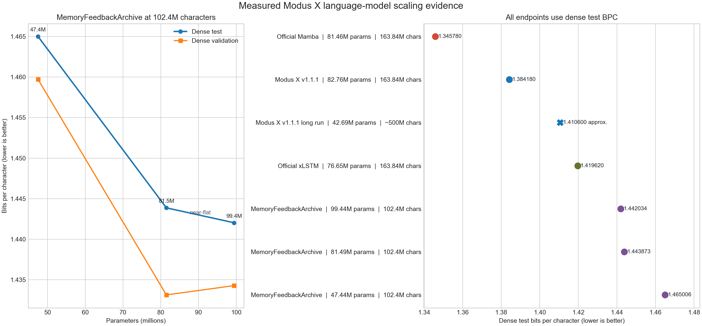
</div>

| Model | Parameters | Dense train-tail | Dense validation | Dense test | Provenance |
|---|---:|---:|---:|---:|---|
| MemoryFeedback 47M | 47,437,768 | 1.408210 | 1.459723 | 1.465006 | **Measured v2** |
| MemoryFeedback 81M | 81,486,728 | 1.360165 | **1.433138** | 1.443873 | **Measured v2** |
| MemoryFeedback 99M | 99,438,920 | **1.355061** | 1.434283 | **1.442034** | **Measured v2** |

The 47M-to-81M interval improves dense test BPC by 0.021133. The
81M-to-99M interval improves test by only 0.001839 and regresses validation by
0.001145. The larger model fits the train tail better without a robust
validation gain. At this data and schedule budget, the curve is saturated.

The comparison is not a pure parameter-only scaling law. The 47M run used a
different learning-rate schedule, all points use one seed, and the 99M
configuration allocates proportionally less capacity to matrix state and the
fixed feedback rank. The permitted conclusion is narrower: the tested
MemoryFeedback family scales strongly from 47M to 81M and then saturates by
99M at 102.4M processed characters.

Both larger checkpoints were then continued to 122.88M characters at LR
`1e-4`. Their dense test BPC improved to 1.408172 (81M) and 1.404835 (99M).
The 99M model remained slightly worse on validation, so the pre-registered
efficiency gate promoted 81M. Continuing that checkpoint with LR `7e-5` and
then `5e-5` produced the matched endpoint:

| Model | Parameters | Characters | Dense validation | Dense test | Provenance |
|---|---:|---:|---:|---:|---|
| Official Mamba | 81,462,656 | 163.84M | **1.350538** | **1.345780** | **Measured baseline** |
| MemoryFeedbackArchive v2 | 81,486,728 | 163.84M | 1.375422 | 1.382445 | **Measured v2** |
| Modus_X v1.1.1 | 82,764,964 | 163.84M | 1.378681 | 1.384180 | **Inherited v1.1.1** |
| Official xLSTM | 76,649,664 | 163.84M | 1.435132 | 1.419620 | **Measured baseline** |

<div align="center">
    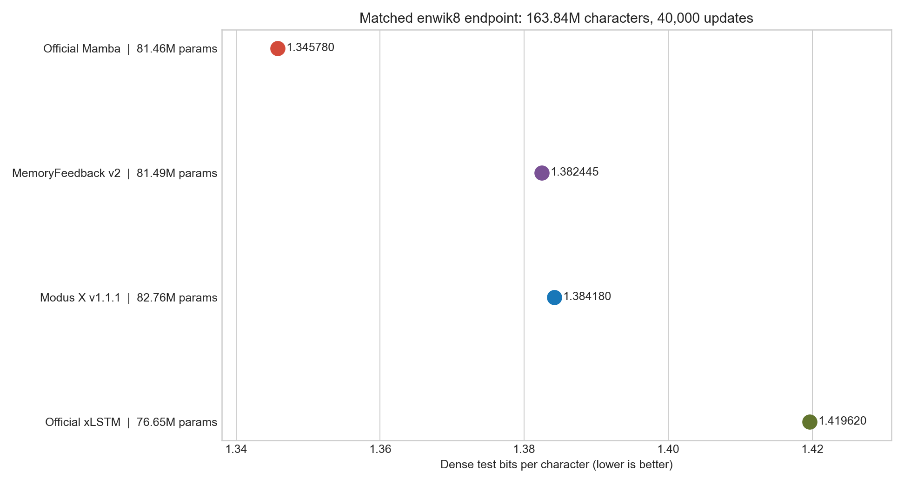
</div>

MemoryFeedback improves v1.1.1 dense test by 0.001735 BPC with 1.54% fewer
parameters. This is a matched but small single-seed improvement requiring
replication, not a Mamba or SOTA win.

### 3.3 CurrentArchiveDelta and the state-budget crossover

CurrentArchiveDelta separates rapidly updated current state from durable
archive state. Its evidence lane measures clean bindings, updated bindings,
historical versions, distractors, and stale latest-value recall.

<div align="center">
    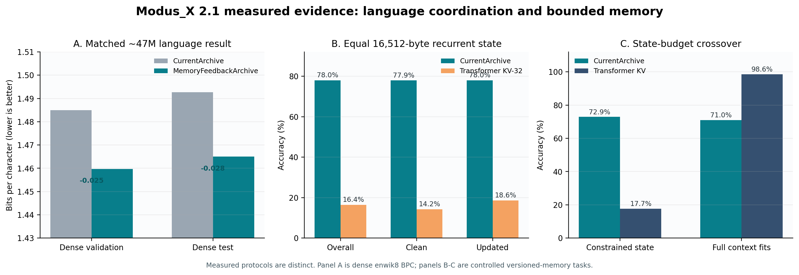
</div>

At 16,512 bytes of recurrent state on the three-seed mixed clean/update
protocol, CurrentArchive reaches 77.95% mean overall accuracy, while the tested
Transformer with a 32-token truncated KV window reaches 16.38%. This is not
evidence that matrix memory universally beats attention. When the state budget
is increased so that the Transformer retains the complete context, the
Transformer reaches 98.63% while CurrentArchive reaches 71.03%.

The result defines a measured crossover:

- full-context KV is the stronger exact retrieval mechanism when it fits;
- bounded CurrentArchive retains more useful history after the KV window is
  forced below the context length;
- CurrentArchive still has a stale latest-value failure mode.

Latest-heavy supervision improves latest-overwritten accuracy by 5.60 points
but does not clear the pre-registered stale-recall ceiling. A latest-shadow
refresh correction makes overwritten latest retrieval and stale recall worse,
so it is rejected.

### 3.4 Systems readiness is not quality

The exact frozen v1-style 1,058,963,121-parameter tree has passed bounded TPU
forward/backward, optimizer, real-data update, checkpoint, and independent
restore smokes. A 1,058,467,601-parameter MemoryFeedback candidate is exactly
counted but has not passed the full ladder or undergone quality training.

These results reduce infrastructure risk. They do not establish 1B language
quality, scaling behavior, throughput, or economics.

---

## 4. Complexity

For a fixed state size $R$, Modus_X inference state is independent of sequence length:

```text
Modus_X state:       O(R^2 + R)
Transformer KV cache O(L * d * layers)
```

This does not mean the current research implementation is faster than a production Transformer kernel. It means the memory growth curve is different. The current prototype demonstrates the algorithmic property; custom kernels are the obvious next systems step.

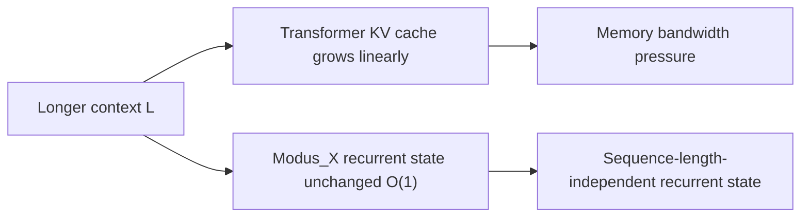

---

## 5. Evidence Design and Experimental Protocols

This paper separates evidence into three protocols rather than blending results from different datasets, scales, and implementations. Historical v1.1.1 rows are labeled wherever they are reused.

### 5.1 Protocol A: Historical FineWeb-Edu Language Modeling

The original release evaluated approximately 154M-parameter models on a held-out FineWeb-Edu token shard. The model configurations were:

* **Transformer reference**: 155.2M parameters, 12 layers, 12 attention heads, embedding dimension 768.
* **Mamba-family base control**: 139.7M parameters, 8 layers, embedding dimension 512.
* **Mamba-family matched control**: 154.0M parameters.
* **Modus_X**: 153.9M parameters, 8 layers, matrix dimension $384 \times 384$.

This evidence is retained because it motivated the architecture and shows learning at a larger parameter scale. It is not the primary v1.1 baseline claim because the recurrent control was a local implementation and the Transformer checkpoint was not trained for the same number of steps as the final Modus_X checkpoint.

**Table 1: Historical FineWeb-Edu results retained from the original release.**

| Model | Parameters | Step | Eval loss | Perplexity | Eval BPC |
|---|---:|---:|---:|---:|---:|
| Mamba-family base control | 139.7M | 40k | 4.322 | 75.33 | 6.235 |
| Mamba-family matched control | 154.0M | 40k | 4.259 | 70.74 | 6.144 |
| Modus_X | 153.9M | 40k | **4.206** | **67.09** | **6.068** |
| Modus_X continuation | 153.9M | 80k | **4.148** | **63.32** | **5.985** |
| Transformer reference | 155.2M | 40k | 4.081 | 59.19 | 5.887 |

The historical result supports two bounded conclusions. First, the matrix stream did not prevent ordinary language-model learning at 154M scale. Second, the matched local recurrent control did not recover the full Modus_X result by parameter count alone. It does **not** establish superiority over official Mamba or over a compute-matched Transformer.

### 5.2 Protocol B: Matched enwik8 Recurrent Baselines

The primary v1.1 compression comparison uses the standard enwik8 split:

* training bytes: first 90,000,000;
* validation bytes: next 5,000,000;
* test bytes: final 5,000,000;
* byte vocabulary: 256 symbols;
* context length: 512;
* processed-character checkpoint for the main comparison: 163,840,000;
* dense evaluation: two deterministic offsets over 9,765 windows per split.

The evaluated models are close in scale:

| Model | Parameters | Implementation status |
|---|---:|---|
| Official Mamba baseline | 81.46M | official Mamba family implementation, trained on T4 GPUs |
| Modus_X | 82.76M | v1.1 implementation, trained on an eight-core Kaggle TPU |
| Official xLSTM baseline | 76.65M | official xLSTM family implementation, trained with TPU mesh data parallelism |

Device count is not a quality advantage by itself: it changes wall-clock throughput, not the amount of supervised data represented by 163.84M processed characters. Nevertheless, kernels, optimizer details, numerical precision, and hardware-specific implementations differ. The result should therefore be described as a tightly aligned empirical comparison, not a formal proof that one architecture dominates all implementations of another.

### 5.3 Protocol C: Balanced Associative Recall and Overwrite

The recall benchmark isolates a capability that BPC can hide: retaining and retrieving independent key-value associations. Inputs contain explicit key-value bindings followed by a query. With 32 possible values, chance accuracy is 3.125%. The recovered Modus_X comparison uses a lean vector-router checkpoint with 152,436 parameters; the official Mamba recall model uses 162,560 parameters. Both are evaluated on the same vocabulary, key dimension, number of pairs, query format, and sequence-length sweep.

The overwrite variant repeats keys and asks for the most recent value. This directly tests whether a recurrent memory can update an existing binding rather than merely accumulate a blurred summary.

---

## 6. Inherited v1.1.1 Language Baseline

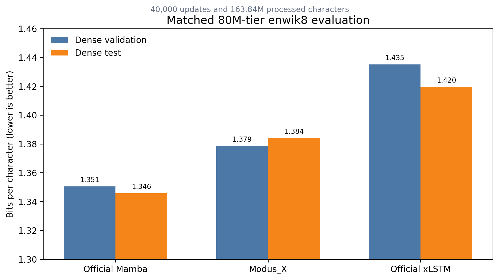

**Table 2: Inherited v1.1.1 dense enwik8 comparison at 163.84M processed characters. Lower is better.**

| Model | Parameters | Dense validation BPC | Dense test BPC | Inference state growth | Provenance |
|---|---:|---:|---:|---|---|
| Official Mamba | 81.46M | **1.3505** | **1.3458** | Constant in sequence length | **Inherited v1.1.1 evidence** |
| **Modus_X v1.1.1** | 82.76M | **1.3787** | **1.3842** | Constant in sequence length | **Inherited v1.1.1** |
| Official xLSTM | 76.65M | 1.4351 | 1.4196 | Constant in sequence length | **Inherited v1.1.1 evidence** |

This table contains both a win and a limitation.

* Modus_X improves dense test BPC over xLSTM by **0.0354 BPC** in the matched-character protocol.
* Mamba improves dense test BPC over Modus_X by **0.0384 BPC**.
* All three systems avoid Transformer-style KV-cache growth.

The correct conclusion is not that enwik8 "does not matter." Compression is a central language-modeling metric, and Mamba is currently stronger under this protocol. The more important architectural observation is that Modus_X remains close in compression while expressing a sharply different recall profile in Section 7. A hybrid architecture is only scientifically interesting if each stream contributes something observable; these two evaluations begin to expose that separation.

### 6.1 Observed Modus_X Scaling Curve

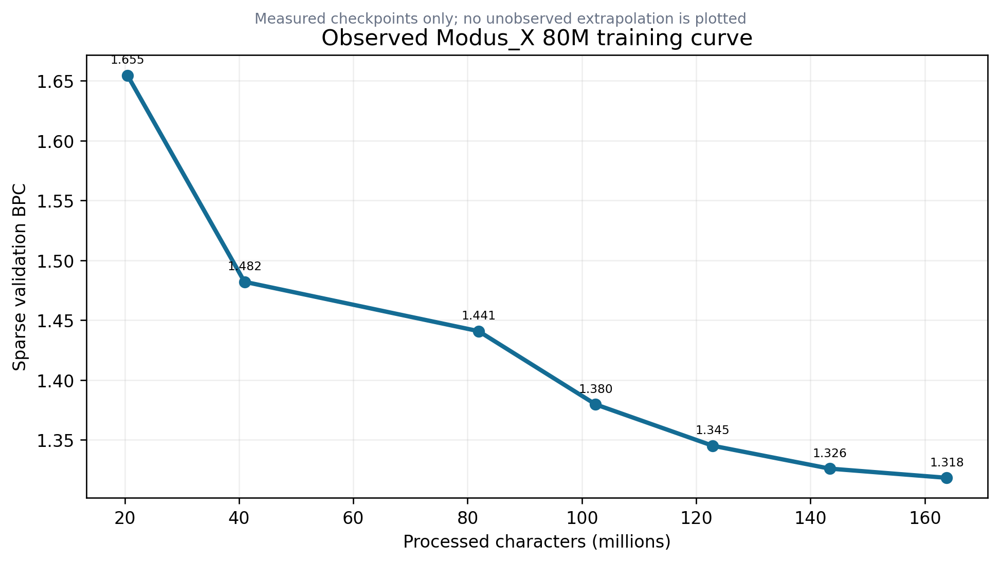

The 82.76M-parameter run improved throughout its measured trajectory:

| Processed characters | Sparse validation BPC |
|---:|---:|
| 20.48M | 1.6546 |
| 40.96M | 1.4820 |
| 81.92M | 1.4408 |
| 102.40M | 1.3796 |
| 122.88M | 1.3451 |
| 143.36M | 1.3260 |
| 163.84M | 1.3183 |

These sparse checkpoint numbers use the run-time evaluator and are not interchangeable with the dense numbers in Table 2. They are useful for optimization and scaling-shape analysis. The curve demonstrates continuing improvement, but its diminishing slope does not justify extrapolating a specific character budget to 1.1 BPC. Version 1.1 deliberately reports the measured region only.

### 6.2 Generalization Audit

The final 80M checkpoint was also evaluated across train-tail, validation, and test windows with linspace, random, and dense offsets:

| Split | Dense offset 0 | Dense half offset |
|---|---:|---:|
| Train tail | 1.2570 | 1.2572 |
| Validation | 1.3787 | 1.3786 |
| Test | 1.3840 | 1.3843 |

The approximately 0.12 BPC train-to-validation gap shows remaining generalization pressure, but it is materially smaller than the gap observed in the earlier 42.69M-parameter 500M-character campaign. Capacity helped: the larger model produced the strongest generalization observed in the project even though it processed fewer characters than the earlier long run.

---

## 7. Controlled Associative Recall

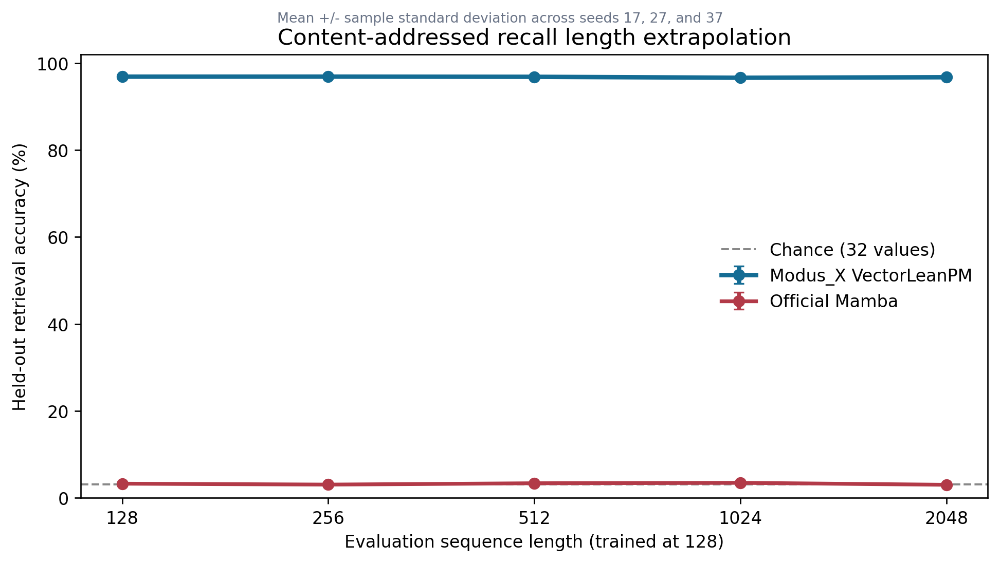

**Table 3: Exact recall accuracy by evaluation length. Higher is better.**

| Model | Params | 128 | 256 | 512 | 1024 | 2048 |
|---|---:|---:|---:|---:|---:|---:|
| **Modus_X VectorLean** | 152,436 | **95.1%** | **94.5%** | **94.8%** | **94.5%** | **94.6%** |
| Official Mamba recall model | 162,560 | 2.85% | 3.70% | 3.30% | 3.28% | 3.33% |
| Chance | - | 3.125% | 3.125% | 3.125% | 3.125% | 3.125% |

The Modus_X result is nearly flat across a 16-fold length increase. The tested Mamba result remains statistically close to chance. This is the strongest current protocol-specific evidence for the matrix-memory hypothesis: in this configuration, the matrix path maintains separable content-addressed bindings that the compact vector recurrence does not preserve.

This result should still be bounded carefully:

* It is a synthetic benchmark, not a direct measurement of factual recall in a pretrained LLM.
* It evaluates one official Mamba configuration and one Modus_X configuration, not all possible hyperparameter settings.
* The conclusion is task-specific: Modus_X is higher by more than 93 percentage points on this tested binding task, not universally better at every form of memory.
* The benchmark is valuable precisely because it is controlled. Natural-language BPC alone cannot identify whether a model has learned persistent binding or merely local statistical continuation.

### 7.1 Same-Key Overwrite

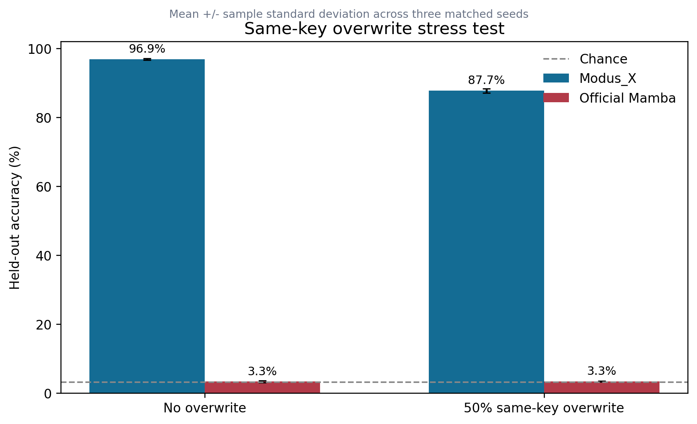

**Table 4: Recovered seed-17 overwrite evidence.**

| Model | Params | No-overwrite exact recall | 50% overwrite exact recall |
|---|---:|---:|---:|
| **Modus_X VectorLean** | 145,674 | **97.325%** | **88.850%** |
| Official Mamba recall model | 162,560 | 2.850% | 3.425% |

Overwrite is a harder test than static storage because the correct answer depends on recency and selective replacement. The Modus_X delta update explicitly computes a residual between the new value and the value currently retrieved by the key. The strong overwrite score is therefore aligned with the mechanism rather than being an incidental metric.

The no-overwrite Modus_X row comes from a confirmation run with the same seed and task family, but not the exact checkpoint used for every length-generalization point in Table 3. The evidence package preserves this distinction instead of merging runs into a fictitious single experiment.

---

## 8. Routing and Component Attribution

The original scalar router computes one gate $r_t \in (0,1)$ for the entire hidden representation. The v1.1 lean vector router computes a gate per feature:

$$r_t = \sigma(W_{rp}\,\text{GeLU}(W_{rh}e_t+b_{rh})+b_{rp})$$
$$y_t = r_t \odot y_t^{matrix} + (1-r_t)\odot y_t^{vector}$$

<div align="center">
    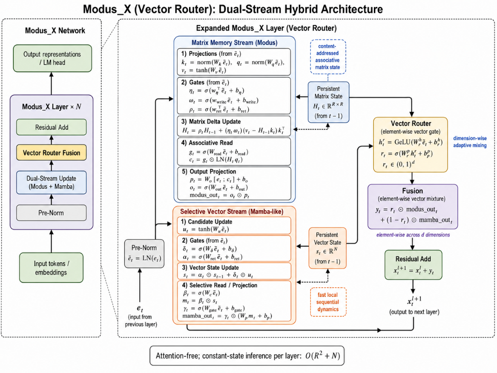
</div>

The conceptual benefit is specialization. A scalar router forces all hidden dimensions to choose the same stream mixture at a token. A vector router permits one subspace to preserve a retrieved entity or value while another tracks syntax, local phase, or recurrence.

The router-width evidence is modest. In the recovered seed-17 width sweep:

| Router | Width | Accuracy |
|---|---:|---:|
| Scalar parameter-matched | - | 96.2% |
| VectorLean | 8 | 96.3% |
| **VectorLean** | **16** | **97.325%** |
| VectorLean | 32 | 96.725% |

Across seeds 17, 27, and 37, VectorLeanPM averages **96.758 +/- 0.317%** at length 2048 without overwrite, versus **96.383 +/- 0.496%** for ScalarPM. The difference is small, and ScalarPM has `156,584` parameters compared with `145,674` for VectorLeanPM, so this is not a general router-superiority claim. Width 16 is retained as a compact recall-oriented default pending language-model evidence.

### 8.1 Stream Intervention

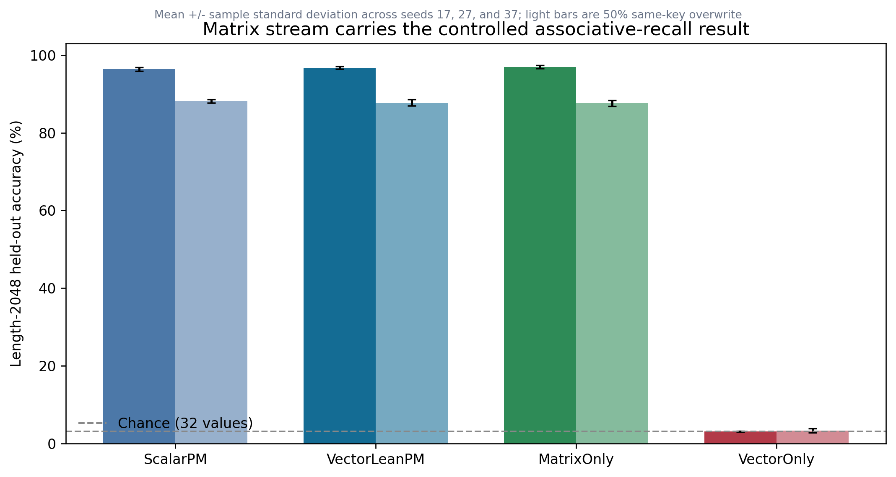

The more decisive experiment holds the lean-vector parameter allocation fixed and changes only which stream reaches the classifier. Across seeds `17`, `27`, and `37`:

| Condition | Variant | Params | Length-2048 accuracy |
|---|---|---:|---:|
| No overwrite | ScalarPM | 156,584 | 96.383 +/- 0.496% |
| No overwrite | VectorLeanPM | 145,674 | 96.758 +/- 0.317% |
| No overwrite | MatrixOnly | 145,674 | **96.992 +/- 0.427%** |
| No overwrite | VectorOnly | 145,674 | 3.100 +/- 0.109% |
| 50% overwrite | VectorLeanPM | 145,674 | 87.758 +/- 0.777% |
| 50% overwrite | MatrixOnly | 145,674 | 87.625 +/- 0.745% |
| 50% overwrite | VectorOnly | 145,674 | 3.308 +/- 0.506% |

With 32 values, chance is `3.125%`. The vector-only intervention therefore fails on the task, while MatrixOnly preserves the result. The controlled conclusion is that the delta-rule matrix stream carries the tested associative binding and overwrite capability. MatrixOnly and VectorOnly are output-stream interventions with the same lean-vector parameter allocation; they are not physically pruned models. This result does not establish that the vector stream is useless for language modeling or local sequence dynamics.

---

## 9. Memory Scaling and Systems Implications

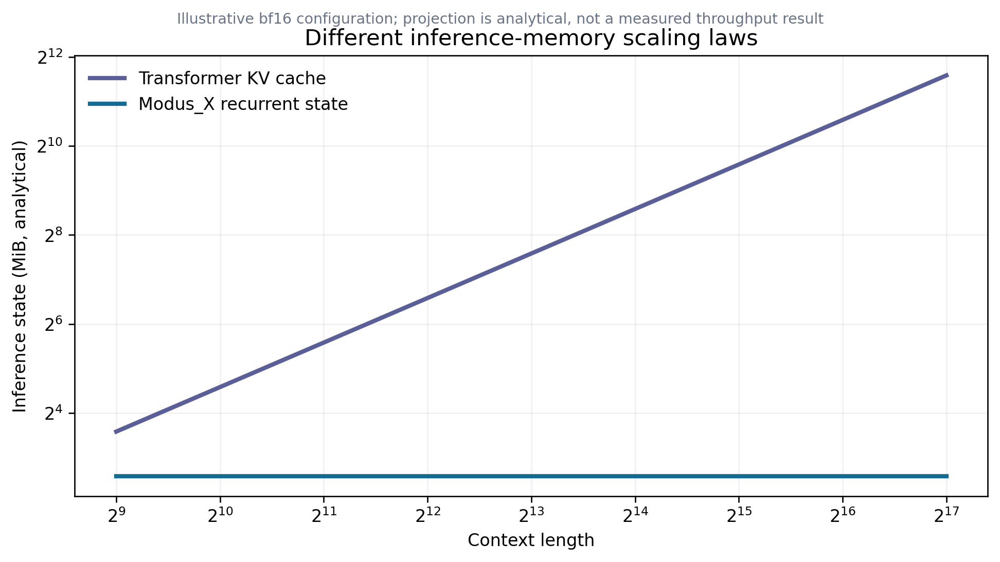

The memory comparison in this section is analytical, not a measured throughput benchmark. For a Transformer decoder with $n$ layers, $h$ KV heads, head dimension $d_h$, precision $b$ bytes, and context length $L$, KV storage scales approximately as:

$$M_{KV}(L) = 2n h d_h b L.$$

For Modus_X, the recurrent state consists of matrix and vector states whose dimensions are fixed after model construction:

$$M_{Modus\_X} = n b (d_m^2 + d_v + \text{auxiliary state}).$$

The matrix state can be larger than a vector SSM state at short contexts; "constant-state" does not mean "free." Its advantage is that extending the generated context does not append another key and value vector for every layer. The chart therefore shows sequence-length dependence, not a universal memory win at every context or batch size.

This distinction matters for scaling:

1. **Long-context serving:** once the fixed state is allocated, additional generated tokens do not enlarge a KV cache.
2. **Streaming:** the model can process indefinitely without retaining the original token history for attention.
3. **Batching:** predictable per-sequence state can simplify capacity planning, although the matrix state may still limit batch size.
4. **Kernel opportunity:** the current implementation uses general JAX/PyTorch operations. Fused delta-update and selective-scan kernels are likely necessary before making wall-clock efficiency claims.

Modus_X currently offers a memory-scaling thesis, not a demonstrated end-to-end serving-cost victory. That thesis is still strategically important: a model line that preserves explicit associative behavior without context-growing state could become more attractive as sequence lengths move from thousands toward millions of tokens.

---

## 10. What the Combined Evidence Means

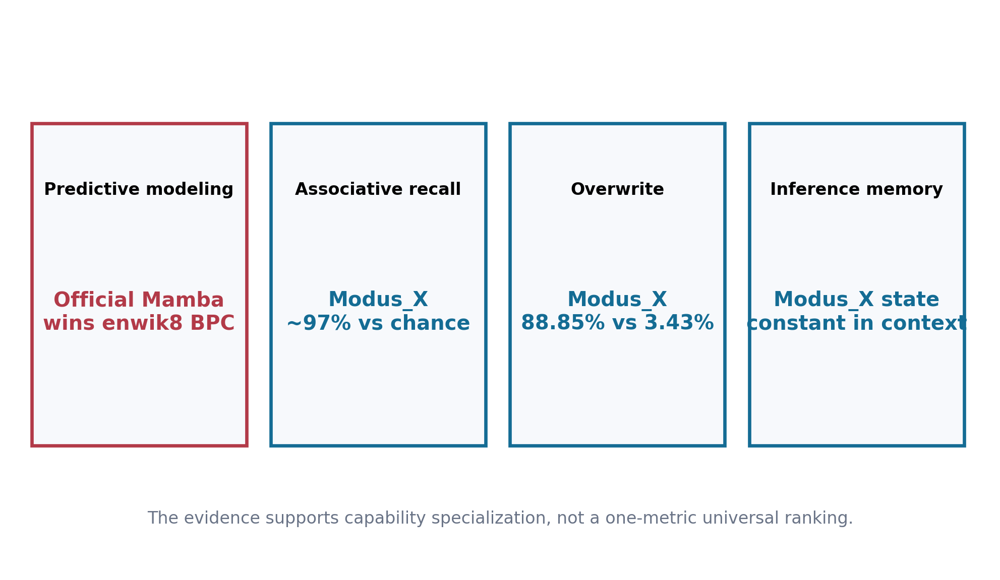

The v1.1 evidence does not reduce to one winner column.

### 10.1 Compression

Official Mamba is the strongest enwik8 model tested here. Modus_X is second and xLSTM third under dense test evaluation. This is a genuine limitation and a useful target: the selective recurrence stream inside Modus_X does not automatically inherit the full compression quality of a dedicated Mamba stack.

### 10.2 Explicit Associative Memory

Modus_X is overwhelmingly stronger on the tested balanced recall and overwrite protocols. The magnitude is too large to dismiss as a minor tuning fluctuation: approximately 95% versus chance across the length sweep, and 88.85% versus 3.425% under overwrite.

### 10.3 Architectural Complementarity

The result supports the reason Modus_X exists. Mamba-like recurrence offers strong sequence compression. Matrix memory offers separable content-addressed storage. Modus_X attempts to place both mechanisms in every layer and learn when each should dominate. The current model has not yet reached the best observed compression, but it exposes a capability that the tested Mamba baseline does not.

### 10.4 Why BPC Is Necessary but Not Sufficient

BPC measures predictive compression over a distribution. It rewards every statistical regularity and remains one of the cleanest language-model metrics. It does not reveal which internal capability produced the compression, nor whether a model can preserve many arbitrary bindings over long intervals. Conversely, synthetic recall cannot substitute for language modeling. A serious architecture must eventually perform both.

The strongest defensible v1.1 statement is:

> Modus_X is a competitive constant-state language model with a demonstrated associative-memory advantage on controlled binding and overwrite tasks. It does not yet lead official Mamba on enwik8 compression.

---

## 11. Training Campaign and Negative Results

The path to v1.1 included an extensive 42.69M-parameter campaign targeting the 1.1 BPC challenge. The best long run reached approximately 1.32 sparse validation BPC after 500M processed characters. A dense audit measured approximately 1.389 validation and 1.411 test BPC, while the train tail reached approximately 1.155 BPC. This established that optimization capacity remained but generalization had become the primary bottleneck.

Several plausible interventions did not produce a promotion-level gain:

* lower auxiliary weight;
* broader multi-layer auxiliary supervision;
* input corruption;
* label smoothing;
* dropout at screened strengths;
* short-to-long context curriculum;
* shallow budget-shape variants;
* naive future-target combinations beyond the useful offset-2 objective;
* SGD/momentum as a replacement for AdamW.

These negative results are scientifically useful. They narrow the next search toward data efficiency, architecture allocation, and mechanism-specific improvements rather than generic regularization. They also prevent the release from presenting a lucky curve without its surrounding failed hypotheses.

The 80M scaling run delivered the most important positive signal after those failures: increasing capacity reduced the dense train-validation gap and improved dense test BPC. This suggests that the architecture was not simply memorizing enwik8; additional capacity improved its representation of held-out bytes.

---

## 12. Limitations and Countervailing Evidence

Every major claim has a corresponding limitation:

| Positive evidence | Limitation or counterevidence |
|---|---|
| Modus_X beats official xLSTM on dense enwik8 test BPC. | Official Mamba remains better by 0.0384 BPC. |
| Modus_X retains approximately 95% recall through length 2048. | The task is synthetic and does not establish LLM-scale factual recall. |
| Modus_X reaches 88.85% overwrite recall. | The comparison covers one task design, one principal seed, and small models. |
| Inference state is constant in sequence length. | The fixed matrix state can be larger than a vector recurrent state, and optimized serving has not been benchmarked. |
| The 80M model scales better than the 42M campaign. | Only one serious 80M trajectory is available; no multi-seed scaling law is claimed. |
| Vector routing improves recall in the recovered sweep. | The gain is modest and has not yet been established on byte-level LM BPC. |
| Historical FineWeb Modus_X beats local matched recurrent controls. | Those controls are not substitutes for current official implementations. |

Additional limitations:

* No custom fused kernel is included, so training speed is not representative of the architecture's possible systems performance.
* The enwik8 runs use different accelerator families for different models. Character budgets and evaluation are aligned, but numerical and kernel paths differ.
* The paper does not claim a 1.1 BPC result. That target remains open.
* The current experiments do not include broad downstream reasoning, instruction following, multilinguality, safety, or factuality evaluation.
* The largest public Modus_X language-model evidence in this release remains below one billion parameters.

These caveats do not erase the wins. They specify exactly what must be reproduced or scaled before the claims become broader.

---

## 13. Reproducibility and Claim Discipline

The release package separates:

* `benchmarks/`: runnable benchmark implementations and commands;
* `evidence/`: claim ledgers and normalized evidence summaries;
* `figures/`: generated charts and their source script;
* `docs/`: architecture, protocol, limitations, and reproduction notes;
* `paper/`: this source and PDF builder;
* `release/`: publication checklist and final artifacts.

Every headline chart is generated from measured values embedded in `figures/generate_figures.py`. The memory-scaling chart is explicitly analytical. No synthetic datapoint is presented as a measured experiment.

The claim policy is:

1. use "official" only for baselines built from the corresponding official model family;
2. distinguish sparse run-time evaluation from dense split evaluation;
3. never compare checkpoints at different processed-character budgets without saying so;
4. retain failures and negative screens in the experiment memory;
5. describe recall superiority as protocol-specific;
6. avoid converting a constant-state property into an unmeasured throughput or energy claim.

---

## 14. Roadmap to a Large Modus_X Model

The next objective is not endless optimization on enwik8. The evidence is now sufficient to define a focused scaling program.

### 14.1 Immediate Architecture Work

* Preserve the dual-stream principle.
* Treat the lean vector router as a compact recall default, then test it on language modeling without claiming a routing advantage in advance.
* Screen matrix/vector state allocation at matched parameter count.
* Add router-specialization diagnostics and regularization only if they produce measurable stream separation.
* Implement stable mixed precision and fused recurrent kernels.

### 14.2 One-Billion-Parameter Gate

A 1B run should proceed only with:

* exact resumable checkpoints;
* a tokenizer and corpus documented independently of the architecture;
* predeclared evaluation at fixed token budgets;
* Mamba, xLSTM, RWKV, and Transformer references where compute permits;
* associative recall and overwrite probes throughout training;
* memory, throughput, and serving-state measurements.

The purpose of the 1B model is not merely to lower perplexity. It is to test whether the separation visible at small scale persists: strong ordinary language modeling, constant recurrent state, and explicit associative behavior.

### 14.3 Grant-Scale Research Question

The grant-worthy question is sharper than "can another architecture train?"

> Can a constant-state language model combine Mamba-class compression with matrix-memory binding strongly enough to become a practical large-model alternative to KV-cache-based attention?

Version 2.1 supplies evidence for both halves separately, while also showing
the remaining gap between them.

---

## 15. Conclusion

Modus_X 2.1 consolidates a multi-axis empirical result and replaces an
open-ended architecture search with two calibrated research leads.

* It retains the v1.1.1 result: the tested 82.76M Modus_X checkpoint beats
  official xLSTM and remains behind official Mamba on dense enwik8 BPC.
* MemoryFeedbackArchive improves the matched 47M CurrentArchive language
  result and scales strongly to 81M at the measured character budget.
* The 99M point exposes fixed-budget saturation; matched annealing promotes
  the more efficient 81M branch, which narrowly improves v1.1.1 at the
  163.84M-character endpoint.
* CurrentArchiveDelta demonstrates a bounded-state advantage after a
  Transformer KV cache can no longer retain the full context, while
  full-context KV remains better.
* The release retains a fixed inference-state size with respect to sequence
  length for each fixed configuration.
* The exact 1B path is systems-tested but not represented as trained quality.

The evidence does not justify calling Modus_X a universal winner. It does
justify taking the architecture seriously. Matrix-to-vector feedback produces
a measurable language gain, while current/archive state produces a measurable
constrained-memory specialization. The remaining scientific problem is to
integrate those properties in one model and test them on natural long-context
tasks without sacrificing ordinary language quality.

Modus_X therefore remains a credible route toward a post-KV-cache model, but
the next decisive experiment is no longer blind scale or further tuning on the
same enwik8 endpoint. It is a matched replication plus natural-memory study
that asks whether coordinated bounded memory creates a real Pareto improvement
in quality, recurrent state, and compute.

---

## References

[1] Ashish Vaswani, Noam Shazeer, Niki Parmar, Jakob Uszkoreit, Llion Jones, Aidan N. Gomez, Lukasz Kaiser, and Illia Polosukhin. **Attention Is All You Need.** NeurIPS, 2017. arXiv:1706.03762. https://arxiv.org/abs/1706.03762

[2] Albert Gu, Karan Goel, and Christopher Re. **Efficiently Modeling Long Sequences with Structured State Spaces.** ICLR, 2022. arXiv:2111.00396. https://arxiv.org/abs/2111.00396

[3] Albert Gu and Tri Dao. **Mamba: Linear-Time Sequence Modeling with Selective State Spaces.** arXiv:2312.00752, 2023. https://arxiv.org/abs/2312.00752

[4] Jürgen Schmidhuber. **Learning to Control Fast-Weight Memories: An Alternative to Dynamic Recurrent Networks.** Neural Computation, 4(1):131-139, 1992. doi:10.1162/neco.1992.4.1.131

[5] Angelos Katharopoulos, Apoorv Vyas, Nikolaos Pappas, and François Fleuret. **Transformers are RNNs: Fast Autoregressive Transformers with Linear Attention.** ICML, 2020. arXiv:2006.16236. https://arxiv.org/abs/2006.16236

[6] Imanol Schlag, Kazuki Irie, and Jürgen Schmidhuber. **Linear Transformers Are Secretly Fast Weight Programmers.** ICML, 2021. arXiv:2102.11174. https://arxiv.org/abs/2102.11174

[7] Yutao Sun, Li Dong, Shaohan Huang, Shuming Ma, Yuqing Xia, Jilong Xue, Jianyong Wang, and Furu Wei. **Retentive Network: A Successor to Transformer for Large Language Models.** arXiv:2307.08621, 2023. https://arxiv.org/abs/2307.08621

[8] Bo Peng, Eric Alcaide, Quentin Anthony, Alon Albalak, Samuel Arcadinho, Stella Biderman, Huanqi Cao, Xin Cheng, Michael Chung, Matteo Grella, Kranthi Kiran GV, Xuzheng He, Haowen Hou, Przemyslaw Kazienko, Jan Kocon, Andrew Majumder, Muhammad S. N. Muhammad, Ruiqi Zhao, and others. **RWKV: Reinventing RNNs for the Transformer Era.** arXiv:2305.13048, 2023. https://arxiv.org/abs/2305.13048

[9] Opher Lieber, Barak Lenz, Hofit Bata, Gal Cohen, Jhonathan Osin, Itay Dalmedigos, Erez Safahi, Shaked Meirom, Yonatan Belinkov, Shai Shalev-Shwartz, Omri Abend, Raz Alon, Tomer Asida, Amnon Shashua, and Yoav Shoham. **Jamba: A Hybrid Transformer-Mamba Language Model.** arXiv:2403.19887, 2024. https://arxiv.org/abs/2403.19887

[10] Soham De, Samuel L. Smith, Anushan Fernando, Aleksandar Botev, George Cristian-Muraru, Albert Gu, Ruba Haroun, Leonard Berrada, Yutian Chen, Srivatsan Srinivasan, Guillaume Desjardins, Arnaud Doucet, David Budden, Yee Whye Teh, Razvan Pascanu, Nando de Freitas, and Caglar Gulcehre. **Griffin: Mixing Gated Linear Recurrences with Local Attention for Efficient Language Models.** arXiv:2402.19427, 2024. https://arxiv.org/abs/2402.19427

[11] Sanyam Chaudhary. **Modus prior matrix-memory work.** Zenodo record 20306315, 2026. https://zenodo.org/records/20306315. Accessed 2026-05-29.

[12] Guilherme Penedo, Hynek Kydlicek, Anton Lozhkov, Margaret Mitchell, Colin Raffel, Leandro von Werra, Thomas Wolf, and others. **The FineWeb Datasets: Decanting the Web for the Finest Text Data at Scale.** NeurIPS Datasets and Benchmarks, 2024. arXiv:2406.17557. https://arxiv.org/abs/2406.17557

[13] Songlin Yang, Bailin Wang, Yu Zhang, Yikang Shen, and Yoon Kim. **Parallelizing Linear Transformers with the Delta Rule over Sequence Length.** NeurIPS, 2024. https://yzhang.site/assets/pubs/neurips/2024/deltanet.pdf

[14] Maximilian Beck, Korbinian Pöppel, Markus Spanring, Andreas Auer, Oleksandra Prudnikova, Michael Kopp, Günter Klambauer, Johannes Brandstetter, and Sepp Hochreiter. **xLSTM: Extended Long Short-Term Memory.** arXiv:2405.04517, 2024. https://arxiv.org/abs/2405.04517

[15] Marcus Hutter. **The Human Knowledge Compression Contest.** enwik8 benchmark and dataset description. http://prize.hutter1.net/

[16] Simran Arora, Sabri Eyuboglu, Aman Timalsina, Isys Johnson, Michael Poli, James Zou, Atri Rudra, and Christopher Re. **Zoology: Measuring and Improving Recall in Efficient Language Models.** arXiv:2312.04927, 2023. https://arxiv.org/abs/2312.04927

[17] Songlin Yang, Jan Kautz, and Ali Hatamizadeh. **Gated Delta Networks: Improving Mamba2 with Delta Rule.** ICLR, 2025. arXiv:2412.06464. https://arxiv.org/abs/2412.06464

[18] Ali Behrouz, Peilin Zhong, and Vahab Mirrokni. **Titans: Learning to Memorize at Test Time.** arXiv:2501.00663, 2025. https://arxiv.org/abs/2501.00663

[19] Kimi Team. **Kimi Linear: An Expressive, Efficient Attention Architecture.** arXiv:2510.26692, 2025. https://arxiv.org/abs/2510.26692

[20] Ali Hatamizadeh, Yejin Choi, and Jan Kautz. **Gated DeltaNet-2: Decoupling Erase and Write in Linear Attention.** arXiv:2605.22791, 2026. https://arxiv.org/abs/2605.22791

[21] Ivan Rodkin, Yuri Kuratov, Aydar Bulatov, and Mikhail Burtsev. **Associative Recurrent Memory Transformer.** arXiv:2407.04841, revised 2025. https://arxiv.org/abs/2407.04841

[22] Gleb Kuzmin, Ivan Rodkin, Aydar Bulatov, Yuri Kuratov, Lyudmila Rvanova, Mikhail Katkov, Ilia Sochenkov, Misha Tsodyks, Timothy Baldwin, Mikhail Burtsev, and Artem Shelmanov. **Extending LLM Context via Associative Recurrent Memory.** arXiv:2607.11614, 2026. https://arxiv.org/abs/2607.11614
