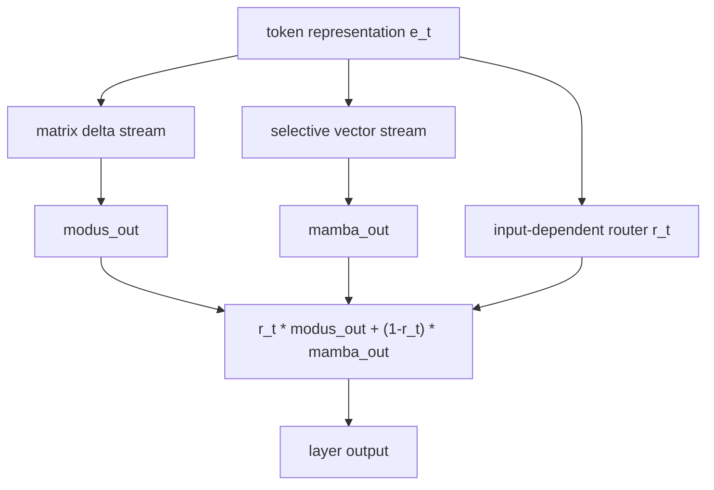

# Modus_X Architecture

Modus_X is a dual-stream recurrent language model. Each layer keeps two constant-size states:

- matrix state `H`, shaped approximately `R x R`, for associative memory,
- vector state `s`, shaped approximately `R`, for selective recurrence.

There is no attention operation and no KV cache.

## Layer Sketch



## Matrix Delta Stream

The matrix stream writes by a delta rule:

```text
old_t = H_{t-1} @ k_t
H_t = retain_t * H_{t-1} + eta_t * write_t * outer(v_t - old_t, k_t)
read_t = H_t @ q_t
```

The key idea is content-addressed overwrite. The update does not merely append; it computes what the current key would retrieve, subtracts that from the desired value, and writes the residual.

## Vector Stream

The vector stream follows the Mamba-like selective recurrence idea:

```text
s_t = retain_s_t * s_{t-1} + delta_t * u_t
```

This stream is cheap and strong for local/sequential dynamics, but it has less associative capacity than a matrix memory. Modus_X keeps both.

## Router

The router computes a context-dependent mixture:

```text
out_t = r_t * modus_out_t + (1 - r_t) * mamba_out_t
```

This lets the model choose between associative matrix memory and vector recurrence at every token and every layer.

## Complexity

For a fixed state size `R`, inference memory is independent of context length:

```text
Modus_X state memory: O(R^2 + R)
Transformer KV cache: O(L * d * layers)
```

The practical claim is not that Modus_X is faster in the current prototype. The claim is that its memory does not grow with generated length.

