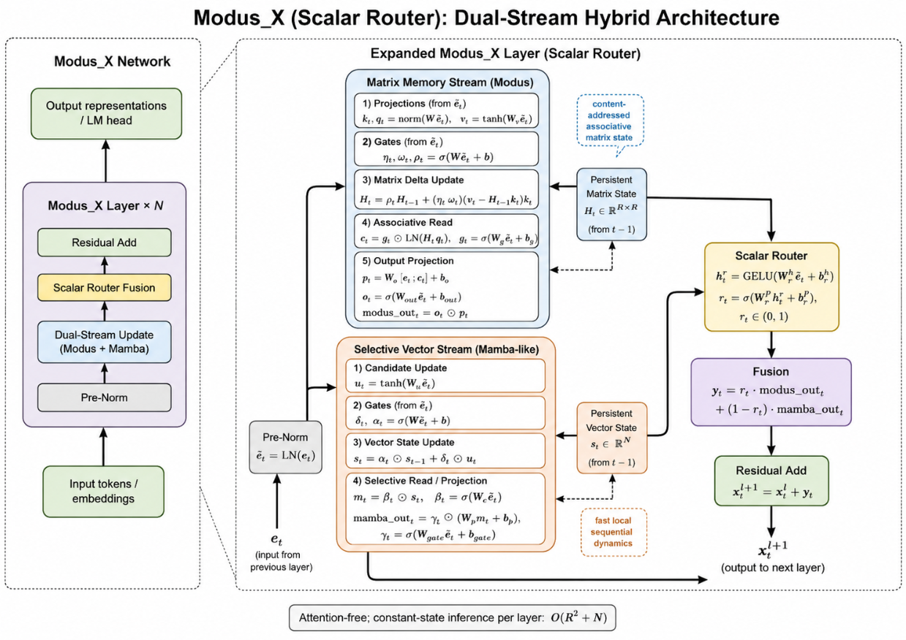
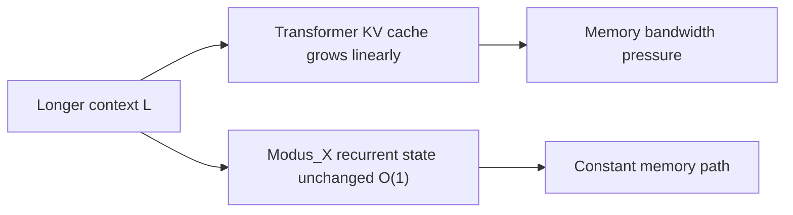
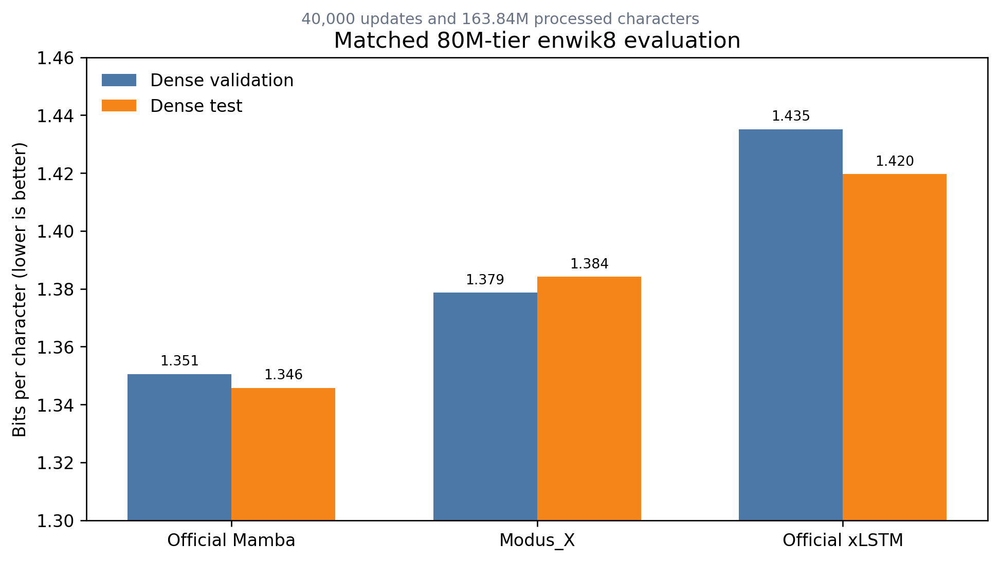
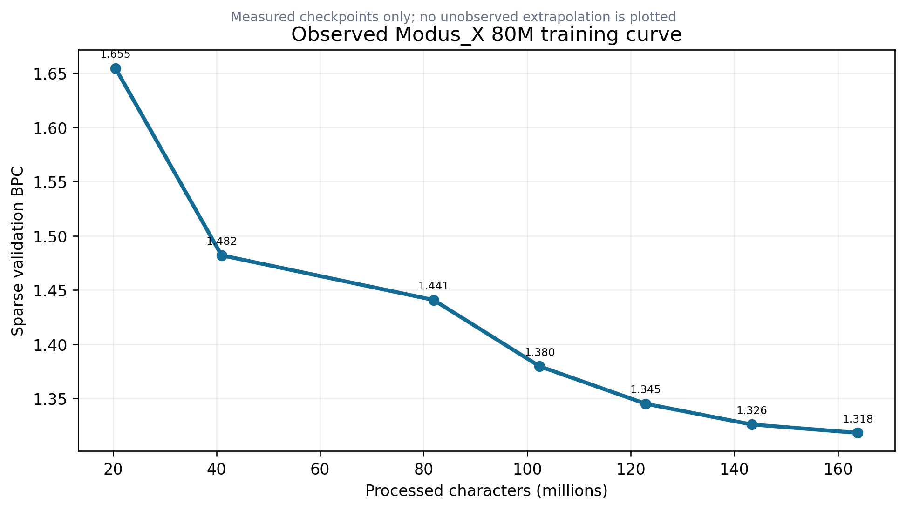
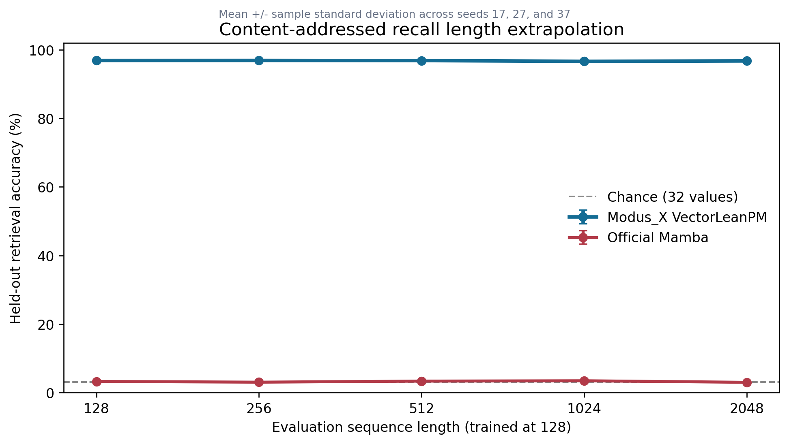
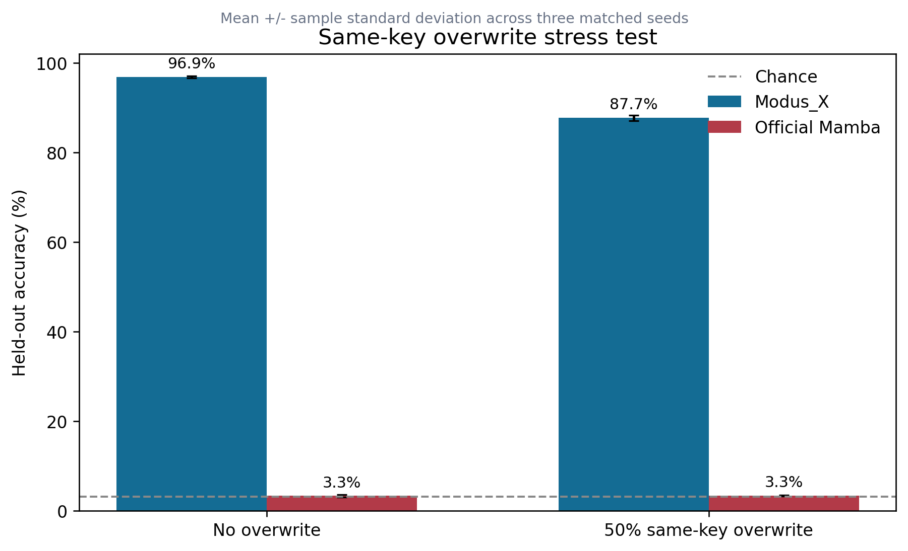
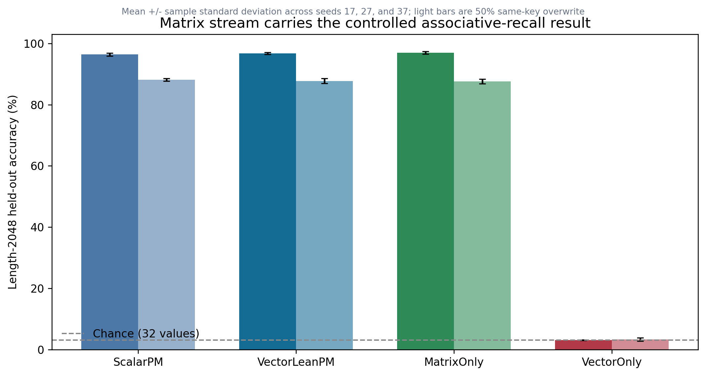
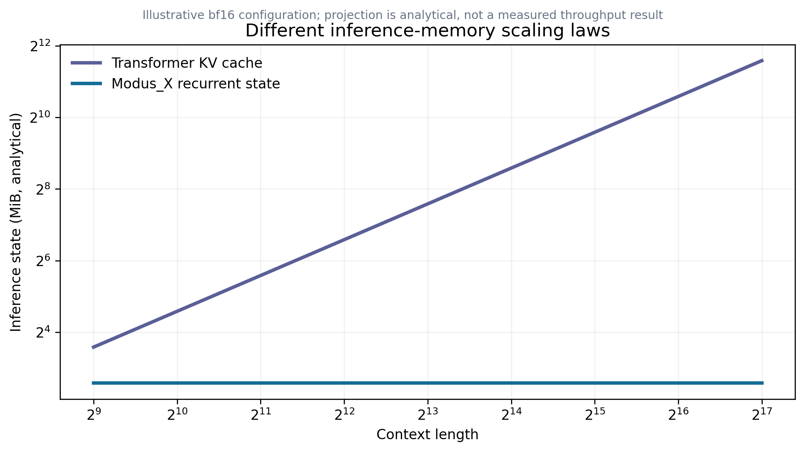
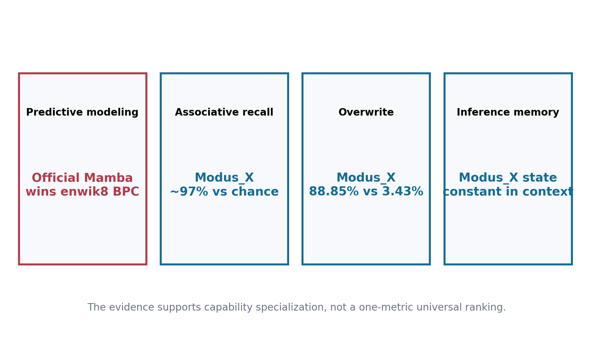

# Modus_X v1.1: Constant-State Language Modeling with Associative Memory and Selective Recurrence

Sanyam Chaudhary  
Independent Researcher, India  
Modus Research Project, June 2026

## Abstract

We introduce **Modus_X**, an attention-free causal sequence architecture that combines a selective recurrent stream for local sequential dynamics with a delta-rule associative matrix stream for content-addressed memory. The resulting model uses fixed recurrent state during autoregressive inference: its cache does not grow with generated sequence length, unlike Transformer key-value caches. This property does not by itself imply lower total compute in every regime, but it creates a distinct systems path for long-context inference.

Version 1.1.1 adds a fourth evidence layer to the prior release package. First, an 82.76M-parameter Modus_X model reaches **1.3842 dense test BPC** on enwik8 after 163.84M processed characters. Under the same dense evaluator, an official xLSTM baseline reaches **1.4196**, while an official Mamba baseline reaches **1.3458**. Thus Modus_X is competitive with strong recurrent families, exceeds the matched xLSTM result in this protocol, and does not yet beat Mamba on byte-level compression. Second, on a balanced associative-recall protocol, Modus_X sustains approximately **94-95% exact recall through length 2048**, while the evaluated Mamba baseline remains near the 3.125% chance level. On same-key overwrite recall, Modus_X reaches **88.85%** versus **3.43%** for the evaluated Mamba configuration. Third, the three-seed component ablation identifies the tested mechanism: MatrixOnly retains `96.992 +/- 0.427%` no-overwrite recall at length 2048 while VectorOnly reaches `3.100 +/- 0.109%`, near chance. The lean element-wise router remains a compact default, but this experiment does not show that routing itself is the source of the recall advantage.

The combined evidence is more informative than any single leaderboard number. Mamba currently wins the enwik8 compression comparison; Modus_X wins the tested associative-memory comparisons and retains constant inference state. We therefore present Modus_X not as a universal replacement, but as a credible architecture line with an experimentally visible specialization: compression quality competitive with recurrent baselines, substantially stronger explicit binding and overwrite behavior in the tested setup, and a memory footprint whose sequence-length dependence differs fundamentally from attention.

---

## 1. Introduction

Causal autoregressive language modeling is dominated by the Transformer architecture introduced by Vaswani et al. [1]. However, the multi-head attention mechanism suffers from two well-known physical limitations:
1. **Quadratic Training Cost**: Training compute scales quadratically, $O(L^2)$, with sequence length $L$.
2. **Linear Inference State Growth**: During inference, the model must store past key and value projections in a KV cache, which grows linearly, $O(L)$, with sequence length. This cache becomes a severe memory-bandwidth bottleneck, limiting maximum context window sizes and throughput.

To address these limitations, recent research has focused on recurrent, attention-free architectures with constant inference state $O(1)$, including structured state-space models such as S4 [2] and Mamba [3], linear-attention and fast-weight formulations [4, 5, 6], and recurrent alternatives such as RetNet and RWKV [7, 8]. While these architectures succeed in linearizing training or rendering inference memory constant, they encounter a fundamental trade-off:
* **Selective SSMs** (e.g., Mamba) are highly effective at local sequential modeling (predicting the next token based on nearby patterns, grammars, and rhythms) but exhibit high interference and poor performance on long-range associative recall.
* **Associative Matrix Memories / Fast-Weight Programmers** (e.g., DeltaNet-style updates [13] and prior Modus matrix-memory work [11]) excel at content-addressed key-value lookup across long horizons, but struggle with the precise local sequential rhythms and grammar tracking necessary for fluid natural language modeling.

In this paper, we present **Modus_X**, a dual-stream hybrid architecture that physically fuses these two paradigms, extending the prior Modus line of matrix-memory models [11] to subword language modeling. Unlike hybrid systems that interleave attention and recurrence at the block level, such as Jamba and Griffin [9, 10], Modus_X operates an associative matrix stream and a selective vector stream inside each layer and combines them via a learned, input-dependent router.

---

## 2. Architecture

Modus_X processes an input sequence of activations $x_1, x_2, \dots, x_L \in \mathbb{R}^d$. Inside each layer, the input is fed into two parallel, independent streams: a local selective vector stream and a long-range matrix memory stream. The outputs of these streams are combined using an input-dependent router.

<div align="center">
    
</div>

### 2.1 The Local Selective Vector Stream (Mamba)

The vector stream keeps a Mamba-like recurrent state [3]. For each input $x_t$, we project to key intermediate states and apply a selective discretization gate, state transition, and input gate:

$$
s_t = \text{retain}_s(x_t) \odot s_{t-1} + \delta_s(x_t) \odot u_t
$$

$$\text{mamba\_out}_t = \text{gate}_s(x_t) \odot \left(W_{p} \cdot s_t\right)$$

This path is efficient and well suited to continuous sequence tracking. It can carry local syntactic flow, recency, and smooth dynamics that do not need a full associative matrix write.

### 2.2 The Matrix Memory Stream (Modus)

The matrix stream keeps a fixed matrix state $H_t$. This is related to fast-weight and linear-attention views of sequence modeling [4, 5, 6], with a delta-rule overwrite mechanism inspired by DeltaNet-style associative updates [13]. Keys and queries address this state, while values define what should be written. The delta update writes only the residual between the desired value and what the key currently retrieves.

$$k_t = \text{normalize}(W_k x_t)$$
$$q_t = \text{normalize}(W_q x_t)$$
$$v_t = \tanh(W_v x_t)$$

$$H_t = \text{retain}_t \odot H_{t-1} + \eta_t \odot \text{write}_t \odot \left(v_t - H_{t-1} k_t\right) k_t^T$$

The retrieval is computed via content-addressed query projection:

$$\text{retrieved}_t = \text{read}_t \odot \text{LayerNorm}(H_t q_t)$$
$$\text{modus\_out}_t = \text{out}_t \odot \left(W_o \cdot [x_t ; \text{retrieved}_t]\right)$$

This update is content-addressed. It does not append a token to a cache. It changes a fixed memory according to the current key and value.

### 2.3 Gated Routing and Fusion

The router computes a token-dependent mixture:

$$y_t = r_t \cdot \text{modus\_out}_t + (1 - r_t) \cdot \text{mamba\_out}_t$$

Modus_X does not statically choose matrix memory or vector recurrence. It lets the representation decide at each token and layer how much to use each memory path.

---

## 3. Complexity

For a fixed state size $R$, Modus_X inference state is independent of sequence length:

```text
Modus_X state:       O(R^2 + R)
Transformer KV cache O(L * d * layers)
```

This does not mean the current research implementation is faster than a production Transformer kernel. It means the memory growth curve is different. The current prototype demonstrates the algorithmic property; custom kernels are the obvious next systems step.



---

## 4. Evidence Design and Experimental Protocols

Version 1.1 separates evidence into three protocols rather than blending results from different datasets, scales, and implementations.

### 4.1 Protocol A: Historical FineWeb-Edu Language Modeling

The original release evaluated approximately 154M-parameter models on a held-out FineWeb-Edu token shard. The model configurations were:

* **Transformer reference**: 155.2M parameters, 12 layers, 12 attention heads, embedding dimension 768.
* **Mamba-family base control**: 139.7M parameters, 8 layers, embedding dimension 512.
* **Mamba-family matched control**: 154.0M parameters.
* **Modus_X**: 153.9M parameters, 8 layers, matrix dimension $384 \times 384$.

This evidence is retained because it motivated the architecture and shows learning at a larger parameter scale. It is not the primary v1.1 baseline claim because the recurrent control was a local implementation and the Transformer checkpoint was not trained for the same number of steps as the final Modus_X checkpoint.

**Table 1: Historical FineWeb-Edu results retained from the original release.**

| Model | Parameters | Step | Eval loss | Perplexity | Eval BPC |
|---|---:|---:|---:|---:|---:|
| Mamba-family base control | 139.7M | 40k | 4.322 | 75.33 | 6.235 |
| Mamba-family matched control | 154.0M | 40k | 4.259 | 70.74 | 6.144 |
| Modus_X | 153.9M | 40k | **4.206** | **67.09** | **6.068** |
| Modus_X continuation | 153.9M | 80k | **4.148** | **63.32** | **5.985** |
| Transformer reference | 155.2M | 40k | 4.081 | 59.19 | 5.887 |

The historical result supports two bounded conclusions. First, the matrix stream did not prevent ordinary language-model learning at 154M scale. Second, the matched local recurrent control did not recover the full Modus_X result by parameter count alone. It does **not** establish superiority over official Mamba or over a compute-matched Transformer.

### 4.2 Protocol B: Matched enwik8 Recurrent Baselines

The primary v1.1 compression comparison uses the standard enwik8 split:

* training bytes: first 90,000,000;
* validation bytes: next 5,000,000;
* test bytes: final 5,000,000;
* byte vocabulary: 256 symbols;
* context length: 512;
* processed-character checkpoint for the main comparison: 163,840,000;
* dense evaluation: two deterministic offsets over 9,765 windows per split.

The evaluated models are close in scale:

| Model | Parameters | Implementation status |
|---|---:|---|
| Official Mamba baseline | 81.46M | official Mamba family implementation, trained on T4 GPUs |
| Modus_X | 82.76M | v1.1 implementation, trained on an eight-core Kaggle TPU |
| Official xLSTM baseline | 76.65M | official xLSTM family implementation, trained with TPU mesh data parallelism |

Device count is not a quality advantage by itself: it changes wall-clock throughput, not the amount of supervised data represented by 163.84M processed characters. Nevertheless, kernels, optimizer details, numerical precision, and hardware-specific implementations differ. The result should therefore be described as a tightly aligned empirical comparison, not a formal proof that one architecture dominates all implementations of another.

### 4.3 Protocol C: Balanced Associative Recall and Overwrite

The recall benchmark isolates a capability that BPC can hide: retaining and retrieving independent key-value associations. Inputs contain explicit key-value bindings followed by a query. With 32 possible values, chance accuracy is 3.125%. The recovered Modus_X comparison uses a lean vector-router checkpoint with 152,436 parameters; the official Mamba recall model uses 162,560 parameters. Both are evaluated on the same vocabulary, key dimension, number of pairs, query format, and sequence-length sweep.

The overwrite variant repeats keys and asks for the most recent value. This directly tests whether a recurrent memory can update an existing binding rather than merely accumulate a blurred summary.

---

## 5. Main Byte-Level Language Modeling Results



**Table 2: Dense enwik8 comparison at 163.84M processed characters. Lower is better.**

| Model | Parameters | Dense validation BPC | Dense test BPC | Inference state growth |
|---|---:|---:|---:|---|
| Official Mamba | 81.46M | **1.3505** | **1.3458** | Constant in sequence length |
| **Modus_X** | 82.76M | **1.3787** | **1.3842** | Constant in sequence length |
| Official xLSTM | 76.65M | 1.4351 | 1.4196 | Constant in sequence length |

This table contains both a win and a limitation.

* Modus_X improves dense test BPC over xLSTM by **0.0354 BPC** in the matched-character protocol.
* Mamba improves dense test BPC over Modus_X by **0.0384 BPC**.
* All three systems avoid Transformer-style KV-cache growth.

The correct conclusion is not that enwik8 "does not matter." Compression is a central language-modeling metric, and Mamba is currently stronger under this protocol. The more important architectural observation is that Modus_X remains close in compression while expressing a sharply different recall profile in Section 6. A hybrid architecture is only scientifically interesting if each stream contributes something observable; these two evaluations begin to expose that separation.

### 5.1 Observed Modus_X Scaling Curve



The 82.76M-parameter run improved throughout its measured trajectory:

| Processed characters | Sparse validation BPC |
|---:|---:|
| 20.48M | 1.6546 |
| 40.96M | 1.4820 |
| 81.92M | 1.4408 |
| 102.40M | 1.3796 |
| 122.88M | 1.3451 |
| 143.36M | 1.3260 |
| 163.84M | 1.3183 |

These sparse checkpoint numbers use the run-time evaluator and are not interchangeable with the dense numbers in Table 2. They are useful for optimization and scaling-shape analysis. The curve demonstrates continuing improvement, but its diminishing slope does not justify extrapolating a specific character budget to 1.1 BPC. Version 1.1 deliberately reports the measured region only.

### 5.2 Generalization Audit

The final 80M checkpoint was also evaluated across train-tail, validation, and test windows with linspace, random, and dense offsets:

| Split | Dense offset 0 | Dense half offset |
|---|---:|---:|
| Train tail | 1.2570 | 1.2572 |
| Validation | 1.3787 | 1.3786 |
| Test | 1.3840 | 1.3843 |

The approximately 0.12 BPC train-to-validation gap shows remaining generalization pressure, but it is materially smaller than the gap observed in the earlier 42.69M-parameter 500M-character campaign. Capacity helped: the larger model produced the strongest generalization observed in the project even though it processed fewer characters than the earlier long run.

---

## 6. Associative Recall: The Primary Capability Win



**Table 3: Exact recall accuracy by evaluation length. Higher is better.**

| Model | Params | 128 | 256 | 512 | 1024 | 2048 |
|---|---:|---:|---:|---:|---:|---:|
| **Modus_X VectorLean** | 152,436 | **95.1%** | **94.5%** | **94.8%** | **94.5%** | **94.6%** |
| Official Mamba recall model | 162,560 | 2.85% | 3.70% | 3.30% | 3.28% | 3.33% |
| Chance | - | 3.125% | 3.125% | 3.125% | 3.125% | 3.125% |

The Modus_X result is nearly flat across a 16-fold length increase. The Mamba result remains statistically close to chance. This is the clearest current evidence for the matrix-memory hypothesis: a matrix can maintain separable content-addressed bindings that are difficult to preserve in a compact vector recurrence under this task.

This result should still be bounded carefully:

* It is a synthetic benchmark, not a direct measurement of factual recall in a pretrained LLM.
* It evaluates one official Mamba configuration and one Modus_X configuration, not all possible hyperparameter settings.
* The conclusion is task-specific: Modus_X is dramatically better on this tested binding task, not universally better at every form of memory.
* The benchmark is valuable precisely because it is controlled. Natural-language BPC alone cannot identify whether a model has learned persistent binding or merely local statistical continuation.

### 6.1 Same-Key Overwrite



**Table 4: Recovered seed-17 overwrite evidence.**

| Model | Params | No-overwrite exact recall | 50% overwrite exact recall |
|---|---:|---:|---:|
| **Modus_X VectorLean** | 145,674 | **97.325%** | **88.850%** |
| Official Mamba recall model | 162,560 | 2.850% | 3.425% |

Overwrite is a harder test than static storage because the correct answer depends on recency and selective replacement. The Modus_X delta update explicitly computes a residual between the new value and the value currently retrieved by the key. The strong overwrite score is therefore aligned with the mechanism rather than being an incidental metric.

The no-overwrite Modus_X row comes from a confirmation run with the same seed and task family, but not the exact checkpoint used for every length-generalization point in Table 3. The evidence package preserves this distinction instead of merging runs into a fictitious single experiment.

---

## 7. Routing and Component Attribution

The original scalar router computes one gate $r_t \in (0,1)$ for the entire hidden representation. The v1.1 lean vector router computes a gate per feature:

$$r_t = \sigma(W_{rp}\,\text{GeLU}(W_{rh}e_t+b_{rh})+b_{rp})$$
$$y_t = r_t \odot y_t^{matrix} + (1-r_t)\odot y_t^{vector}$$

<div align="center">
    
</div>

The conceptual benefit is specialization. A scalar router forces all hidden dimensions to choose the same stream mixture at a token. A vector router permits one subspace to preserve a retrieved entity or value while another tracks syntax, local phase, or recurrence.

The router-width evidence is modest. In the recovered seed-17 width sweep:

| Router | Width | Accuracy |
|---|---:|---:|
| Scalar parameter-matched | - | 96.2% |
| VectorLean | 8 | 96.3% |
| **VectorLean** | **16** | **97.325%** |
| VectorLean | 32 | 96.725% |

Across seeds 17, 27, and 37, VectorLeanPM averages **96.758 +/- 0.317%** at length 2048 without overwrite, versus **96.383 +/- 0.496%** for ScalarPM. The difference is small, and ScalarPM has `156,584` parameters compared with `145,674` for VectorLeanPM, so this is not a general router-superiority claim. Width 16 is retained as a compact recall-oriented default pending language-model evidence.

### 7.1 Stream Intervention



The more decisive experiment holds the lean-vector parameter allocation fixed and changes only which stream reaches the classifier. Across seeds `17`, `27`, and `37`:

| Condition | Variant | Params | Length-2048 accuracy |
|---|---|---:|---:|
| No overwrite | ScalarPM | 156,584 | 96.383 +/- 0.496% |
| No overwrite | VectorLeanPM | 145,674 | 96.758 +/- 0.317% |
| No overwrite | MatrixOnly | 145,674 | **96.992 +/- 0.427%** |
| No overwrite | VectorOnly | 145,674 | 3.100 +/- 0.109% |
| 50% overwrite | VectorLeanPM | 145,674 | 87.758 +/- 0.777% |
| 50% overwrite | MatrixOnly | 145,674 | 87.625 +/- 0.745% |
| 50% overwrite | VectorOnly | 145,674 | 3.308 +/- 0.506% |

With 32 values, chance is `3.125%`. The vector-only intervention therefore fails on the task, while MatrixOnly preserves the result. The controlled conclusion is that the delta-rule matrix stream carries the tested associative binding and overwrite capability. MatrixOnly and VectorOnly are output-stream interventions with the same lean-vector parameter allocation; they are not physically pruned models. This result does not establish that the vector stream is useless for language modeling or local sequence dynamics.

---

## 8. Memory Scaling and Systems Implications



The memory comparison in this section is analytical, not a measured throughput benchmark. For a Transformer decoder with $n$ layers, $h$ KV heads, head dimension $d_h$, precision $b$ bytes, and context length $L$, KV storage scales approximately as:

$$M_{KV}(L) = 2n h d_h b L.$$

For Modus_X, the recurrent state consists of matrix and vector states whose dimensions are fixed after model construction:

$$M_{Modus\_X} = n b (d_m^2 + d_v + \text{auxiliary state}).$$

The matrix state can be larger than a vector SSM state at short contexts; "constant-state" does not mean "free." Its advantage is that extending the generated context does not append another key and value vector for every layer. The chart therefore shows sequence-length dependence, not a universal memory win at every context or batch size.

This distinction matters for scaling:

1. **Long-context serving:** once the fixed state is allocated, additional generated tokens do not enlarge a KV cache.
2. **Streaming:** the model can process indefinitely without retaining the original token history for attention.
3. **Batching:** predictable per-sequence state can simplify capacity planning, although the matrix state may still limit batch size.
4. **Kernel opportunity:** the current implementation uses general JAX/PyTorch operations. Fused delta-update and selective-scan kernels are likely necessary before making wall-clock efficiency claims.

Modus_X currently offers a memory-scaling thesis, not a demonstrated end-to-end serving-cost victory. That thesis is still strategically important: a model line that preserves explicit associative behavior without context-growing state could become more attractive as sequence lengths move from thousands toward millions of tokens.

---

## 9. What the Combined Evidence Means



The v1.1 evidence does not reduce to one winner column.

### 9.1 Compression

Official Mamba is the strongest enwik8 model tested here. Modus_X is second and xLSTM third under dense test evaluation. This is a genuine limitation and a useful target: the selective recurrence stream inside Modus_X does not automatically inherit the full compression quality of a dedicated Mamba stack.

### 9.2 Explicit Associative Memory

Modus_X is overwhelmingly stronger on the tested balanced recall and overwrite protocols. The magnitude is too large to dismiss as a minor tuning fluctuation: approximately 95% versus chance across the length sweep, and 88.85% versus 3.425% under overwrite.

### 9.3 Architectural Complementarity

The result supports the reason Modus_X exists. Mamba-like recurrence offers strong sequence compression. Matrix memory offers separable content-addressed storage. Modus_X attempts to place both mechanisms in every layer and learn when each should dominate. The current model has not yet reached the best observed compression, but it exposes a capability that the tested Mamba baseline does not.

### 9.4 Why BPC Is Necessary but Not Sufficient

BPC measures predictive compression over a distribution. It rewards every statistical regularity and remains one of the cleanest language-model metrics. It does not reveal which internal capability produced the compression, nor whether a model can preserve many arbitrary bindings over long intervals. Conversely, synthetic recall cannot substitute for language modeling. A serious architecture must eventually perform both.

The strongest defensible v1.1 statement is:

> Modus_X is a competitive constant-state language model with a demonstrated associative-memory advantage on controlled binding and overwrite tasks. It does not yet lead official Mamba on enwik8 compression.

---

## 10. Training Campaign and Negative Results

The path to v1.1 included an extensive 42.69M-parameter campaign targeting the 1.1 BPC challenge. The best long run reached approximately 1.32 sparse validation BPC after 500M processed characters. A dense audit measured approximately 1.389 validation and 1.411 test BPC, while the train tail reached approximately 1.155 BPC. This established that optimization capacity remained but generalization had become the primary bottleneck.

Several plausible interventions did not produce a promotion-level gain:

* lower auxiliary weight;
* broader multi-layer auxiliary supervision;
* input corruption;
* label smoothing;
* dropout at screened strengths;
* short-to-long context curriculum;
* shallow budget-shape variants;
* naive future-target combinations beyond the useful offset-2 objective;
* SGD/momentum as a replacement for AdamW.

These negative results are scientifically useful. They narrow the next search toward data efficiency, architecture allocation, and mechanism-specific improvements rather than generic regularization. They also prevent the release from presenting a lucky curve without its surrounding failed hypotheses.

The 80M scaling run delivered the most important positive signal after those failures: increasing capacity reduced the dense train-validation gap and improved dense test BPC. This suggests that the architecture was not simply memorizing enwik8; additional capacity improved its representation of held-out bytes.

---

## 11. Limitations and Countervailing Evidence

Every major claim has a corresponding limitation:

| Positive evidence | Limitation or counterevidence |
|---|---|
| Modus_X beats official xLSTM on dense enwik8 test BPC. | Official Mamba remains better by 0.0384 BPC. |
| Modus_X retains approximately 95% recall through length 2048. | The task is synthetic and does not establish LLM-scale factual recall. |
| Modus_X reaches 88.85% overwrite recall. | The comparison covers one task design, one principal seed, and small models. |
| Inference state is constant in sequence length. | The fixed matrix state can be larger than a vector recurrent state, and optimized serving has not been benchmarked. |
| The 80M model scales better than the 42M campaign. | Only one serious 80M trajectory is available; no multi-seed scaling law is claimed. |
| Vector routing improves recall in the recovered sweep. | The gain is modest and has not yet been established on byte-level LM BPC. |
| Historical FineWeb Modus_X beats local matched recurrent controls. | Those controls are not substitutes for current official implementations. |

Additional limitations:

* No custom fused kernel is included, so training speed is not representative of the architecture's possible systems performance.
* The enwik8 runs use different accelerator families for different models. Character budgets and evaluation are aligned, but numerical and kernel paths differ.
* The paper does not claim a 1.1 BPC result. That target remains open.
* The current experiments do not include broad downstream reasoning, instruction following, multilinguality, safety, or factuality evaluation.
* The largest public Modus_X language-model evidence in this release remains below one billion parameters.

These caveats do not erase the wins. They specify exactly what must be reproduced or scaled before the claims become broader.

---

## 12. Reproducibility and Claim Discipline

The release package separates:

* `benchmarks/`: runnable benchmark implementations and commands;
* `evidence/`: claim ledgers and normalized evidence summaries;
* `figures/`: generated charts and their source script;
* `docs/`: architecture, protocol, limitations, and reproduction notes;
* `paper/`: this source and PDF builder;
* `release/`: publication checklist and final artifacts.

Every headline chart is generated from measured values embedded in `figures/generate_figures.py`. The memory-scaling chart is explicitly analytical. No synthetic datapoint is presented as a measured experiment.

The claim policy is:

1. use "official" only for baselines built from the corresponding official model family;
2. distinguish sparse run-time evaluation from dense split evaluation;
3. never compare checkpoints at different processed-character budgets without saying so;
4. retain failures and negative screens in the experiment memory;
5. describe recall superiority as protocol-specific;
6. avoid converting a constant-state property into an unmeasured throughput or energy claim.

---

## 13. Roadmap to a Large Modus_X Model

The next objective is not endless optimization on enwik8. The evidence is now sufficient to define a focused scaling program.

### 13.1 Immediate Architecture Work

* Preserve the dual-stream principle.
* Treat the lean vector router as a compact recall default, then test it on language modeling without claiming a routing advantage in advance.
* Screen matrix/vector state allocation at matched parameter count.
* Add router-specialization diagnostics and regularization only if they produce measurable stream separation.
* Implement stable mixed precision and fused recurrent kernels.

### 13.2 One-Billion-Parameter Gate

A 1B run should proceed only with:

* exact resumable checkpoints;
* a tokenizer and corpus documented independently of the architecture;
* predeclared evaluation at fixed token budgets;
* Mamba, xLSTM, RWKV, and Transformer references where compute permits;
* associative recall and overwrite probes throughout training;
* memory, throughput, and serving-state measurements.

The purpose of the 1B model is not merely to lower perplexity. It is to test whether the separation visible at small scale persists: strong ordinary language modeling, constant recurrent state, and explicit associative behavior.

### 13.3 Grant-Scale Research Question

The grant-worthy question is sharper than "can another architecture train?"

> Can a constant-state language model combine Mamba-class compression with matrix-memory binding strongly enough to become a practical large-model alternative to KV-cache-based attention?

Version 1.1 supplies evidence for both halves separately, while also showing the remaining gap between them.

---

## 14. Conclusion

Modus_X v1.1.1 moves the project from a promising architectural proposal to a multi-axis empirical result.

* It trains as a competitive 82.76M-parameter byte language model.
* It beats the official xLSTM baseline in the matched dense enwik8 test comparison.
* It remains behind official Mamba on enwik8 BPC.
* It decisively outperforms the evaluated Mamba configuration on balanced associative recall and same-key overwrite.
* It shows that the matrix stream, rather than vector-only output, carries the tested associative-recall result.
* It retains a fixed inference state with respect to sequence length.
* Its larger-capacity run improves generalization relative to the earlier 42M campaign.

The evidence does not justify calling Modus_X a universal winner. It does justify taking the architecture seriously. The matrix stream produces a capability that is visible, stable across tested lengths, mechanistically attributed by the component intervention, and aligned with the delta rule. The recurrent stream remains part of the language-modeling design, but the current ablation does not demonstrate that it creates the associative effect. The router provides a path to combine them rather than choosing one memory geometry for every feature.

Modus_X therefore represents a credible route toward a post-KV-cache model: not because every benchmark is already won, but because the architecture demonstrates a rare combination of competitive compression, constant recurrent state, and strong explicit binding. The next decisive experiment is scale.

---

## References

[1] Ashish Vaswani, Noam Shazeer, Niki Parmar, Jakob Uszkoreit, Llion Jones, Aidan N. Gomez, Lukasz Kaiser, and Illia Polosukhin. **Attention Is All You Need.** NeurIPS, 2017. arXiv:1706.03762. https://arxiv.org/abs/1706.03762

[2] Albert Gu, Karan Goel, and Christopher Re. **Efficiently Modeling Long Sequences with Structured State Spaces.** ICLR, 2022. arXiv:2111.00396. https://arxiv.org/abs/2111.00396

[3] Albert Gu and Tri Dao. **Mamba: Linear-Time Sequence Modeling with Selective State Spaces.** arXiv:2312.00752, 2023. https://arxiv.org/abs/2312.00752

[4] Jürgen Schmidhuber. **Learning to Control Fast-Weight Memories: An Alternative to Dynamic Recurrent Networks.** Neural Computation, 4(1):131-139, 1992. doi:10.1162/neco.1992.4.1.131

[5] Angelos Katharopoulos, Apoorv Vyas, Nikolaos Pappas, and François Fleuret. **Transformers are RNNs: Fast Autoregressive Transformers with Linear Attention.** ICML, 2020. arXiv:2006.16236. https://arxiv.org/abs/2006.16236

[6] Imanol Schlag, Kazuki Irie, and Jürgen Schmidhuber. **Linear Transformers Are Secretly Fast Weight Programmers.** ICML, 2021. arXiv:2102.11174. https://arxiv.org/abs/2102.11174

[7] Yutao Sun, Li Dong, Shaohan Huang, Shuming Ma, Yuqing Xia, Jilong Xue, Jianyong Wang, and Furu Wei. **Retentive Network: A Successor to Transformer for Large Language Models.** arXiv:2307.08621, 2023. https://arxiv.org/abs/2307.08621

[8] Bo Peng, Eric Alcaide, Quentin Anthony, Alon Albalak, Samuel Arcadinho, Stella Biderman, Huanqi Cao, Xin Cheng, Michael Chung, Matteo Grella, Kranthi Kiran GV, Xuzheng He, Haowen Hou, Przemyslaw Kazienko, Jan Kocon, Andrew Majumder, Muhammad S. N. Muhammad, Ruiqi Zhao, and others. **RWKV: Reinventing RNNs for the Transformer Era.** arXiv:2305.13048, 2023. https://arxiv.org/abs/2305.13048

[9] Opher Lieber, Barak Lenz, Hofit Bata, Gal Cohen, Jhonathan Osin, Itay Dalmedigos, Erez Safahi, Shaked Meirom, Yonatan Belinkov, Shai Shalev-Shwartz, Omri Abend, Raz Alon, Tomer Asida, Amnon Shashua, and Yoav Shoham. **Jamba: A Hybrid Transformer-Mamba Language Model.** arXiv:2403.19887, 2024. https://arxiv.org/abs/2403.19887

[10] Soham De, Samuel L. Smith, Anushan Fernando, Aleksandar Botev, George Cristian-Muraru, Albert Gu, Ruba Haroun, Leonard Berrada, Yutian Chen, Srivatsan Srinivasan, Guillaume Desjardins, Arnaud Doucet, David Budden, Yee Whye Teh, Razvan Pascanu, Nando de Freitas, and Caglar Gulcehre. **Griffin: Mixing Gated Linear Recurrences with Local Attention for Efficient Language Models.** arXiv:2402.19427, 2024. https://arxiv.org/abs/2402.19427

[11] Sanyam Chaudhary. **Modus prior matrix-memory work.** Zenodo record 20306315, 2026. https://zenodo.org/records/20306315. Accessed 2026-05-29.

[12] Guilherme Penedo, Hynek Kydlicek, Anton Lozhkov, Margaret Mitchell, Colin Raffel, Leandro von Werra, Thomas Wolf, and others. **The FineWeb Datasets: Decanting the Web for the Finest Text Data at Scale.** NeurIPS Datasets and Benchmarks, 2024. arXiv:2406.17557. https://arxiv.org/abs/2406.17557

[13] Songlin Yang, Bailin Wang, Yu Zhang, Yikang Shen, and Yoon Kim. **Parallelizing Linear Transformers with the Delta Rule over Sequence Length.** NeurIPS, 2024. https://yzhang.site/assets/pubs/neurips/2024/deltanet.pdf

[14] Maximilian Beck, Korbinian Pöppel, Markus Spanring, Andreas Auer, Oleksandra Prudnikova, Michael Kopp, Günter Klambauer, Johannes Brandstetter, and Sepp Hochreiter. **xLSTM: Extended Long Short-Term Memory.** arXiv:2405.04517, 2024. https://arxiv.org/abs/2405.04517

[15] Marcus Hutter. **The Human Knowledge Compression Contest.** enwik8 benchmark and dataset description. http://prize.hutter1.net/
