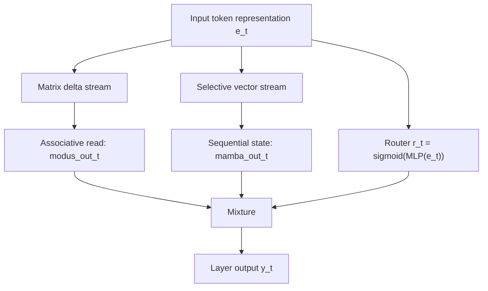
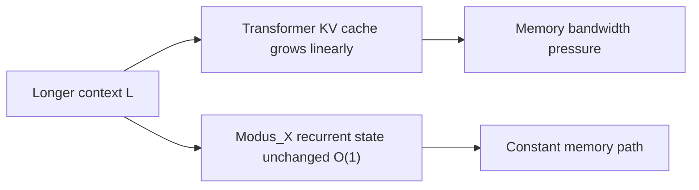
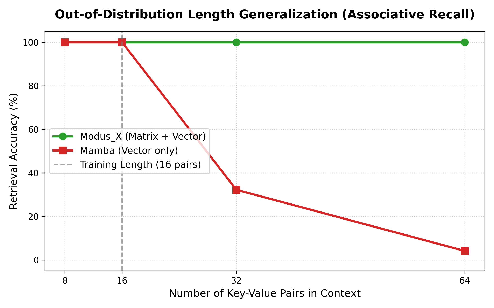
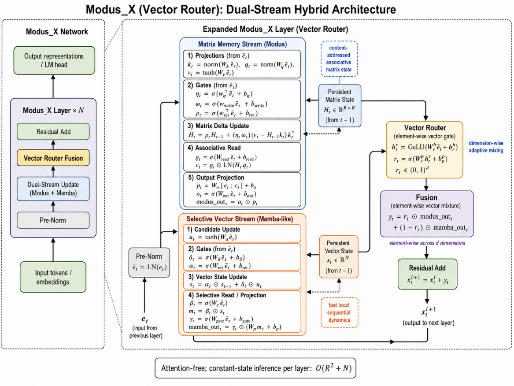
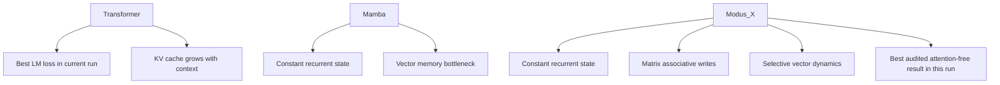

# Modus_X: Dual-Stream Hybrid Language Modeling with Associative Matrix Memory and Selective State Spaces

Sanyam Chaudhary  
Independent Researcher, India  
Modus Research Project, May 2026

## Abstract

We introduce **Modus_X**, a novel attention-free causal sequence architecture that integrates two complementary sequence modeling paradigms: selective state-space models (SSMs) for capturing fast, local sequential dynamics, and a content-addressed associative matrix memory using delta-rule updates for long-range associative recall. Unlike traditional Transformers [1], Modus_X does not employ attention mechanisms or key-value (KV) caches, resulting in $O(L)$ training complexity and $O(1)$ constant inference memory footprint with respect to sequence length. 

To evaluate the architecture under controlled conditions, we train Modus_X, Transformer, and Mamba-family baselines on the FineWeb-Edu dataset [12]. Our experiments demonstrate that Modus_X achieves superior perplexity compared to the audited Mamba recurrent baseline, while an internal parameter-matched Mamba control suggests that the gain is architectural rather than merely parameter-count driven. Against the Transformer, we use the 40k checkpoint as a reference baseline rather than a strict compute-matched comparison: the Transformer remains lower at 40k, while Modus_X continues to improve through 80k and narrows the short-context language-modeling gap while preserving constant recurrent state.

Crucially, synthetic associative recall stress tests indicate the intended qualitative separation: vector-state recurrence suffers interference as the number of independent key-value bindings grows, while the Modus_X matrix stream is designed for content-addressed lookup and overwrite. Modus_X is therefore not yet a Transformer replacement on every metric, but it is a strong attention-free, constant-state contender and a promising second path for long-context modeling.

---

## 1. Introduction

Causal autoregressive language modeling is dominated by the Transformer architecture introduced by Vaswani et al. [1]. However, the multi-head attention mechanism suffers from two well-known physical limitations:
1. **Quadratic Training Cost**: Training compute scales quadratically, $O(L^2)$, with sequence length $L$.
2. **Linear Inference State Growth**: During inference, the model must store past key and value projections in a KV cache, which grows linearly, $O(L)$, with sequence length. This cache becomes a severe memory-bandwidth bottleneck, limiting maximum context window sizes and throughput.

To address these limitations, recent research has focused on recurrent, attention-free architectures with constant inference state $O(1)$, including structured state-space models such as S4 [2] and Mamba [3], linear-attention and fast-weight formulations [4, 5, 6], and recurrent alternatives such as RetNet and RWKV [7, 8]. While these architectures succeed in linearizing training or rendering inference memory constant, they encounter a fundamental trade-off:
* **Selective SSMs** (e.g., Mamba) are highly effective at local sequential modeling (predicting the next token based on nearby patterns, grammars, and rhythms) but exhibit high interference and poor performance on long-range associative recall.
* **Associative Matrix Memories / Fast-Weight Programmers** (e.g., DeltaNet-style updates [13] and prior Modus matrix-memory work [11]) excel at content-addressed key-value lookup across long horizons, but struggle with the precise local sequential rhythms and grammar tracking necessary for fluid natural language modeling.

In this paper, we present **Modus_X**, a dual-stream hybrid architecture that physically fuses these two paradigms, extending the prior Modus line of matrix-memory models [11] to subword language modeling. Unlike hybrid systems that interleave attention and recurrence at the block level, such as Jamba and Griffin [9, 10], Modus_X operates an associative matrix stream and a selective vector stream inside each layer and combines them via a learned, input-dependent router.

---

## 2. Architecture

Modus_X processes an input sequence of activations $x_1, x_2, \dots, x_L \in \mathbb{R}^d$. Inside each layer, the input is fed into two parallel, independent streams: a local selective vector stream and a long-range matrix memory stream. The outputs of these streams are combined using an input-dependent router.



<div align="center">
    
</div>

### 2.1 The Local Selective Vector Stream (Mamba)

The vector stream keeps a Mamba-like recurrent state [3]. For each input $x_t$, we project to key intermediate states and apply a selective discretization gate, state transition, and input gate:

$$
s_t = \text{retain}_s(x_t) \odot s_{t-1} + \delta_s(x_t) \odot u_t
$$

$$\text{mamba\_out}_t = \text{gate}_s(x_t) \odot \left(W_{p} \cdot s_t\right)$$

This path is efficient and well suited to continuous sequence tracking. It can carry local syntactic flow, recency, and smooth dynamics that do not need a full associative matrix write.

### 2.2 The Matrix Memory Stream (Modus)

The matrix stream keeps a fixed matrix state $H_t$. This is related to fast-weight and linear-attention views of sequence modeling [4, 5, 6], with a delta-rule overwrite mechanism inspired by DeltaNet-style associative updates [13]. Keys and queries address this state, while values define what should be written. The delta update writes only the residual between the desired value and what the key currently retrieves.

$$k_t = \text{normalize}(W_k x_t)$$
$$q_t = \text{normalize}(W_q x_t)$$
$$v_t = \tanh(W_v x_t)$$

$$H_t = \text{retain}_t \odot H_{t-1} + \eta_t \odot \text{write}_t \odot \left(v_t - H_{t-1} k_t\right) k_t^T$$

The retrieval is computed via content-addressed query projection:

$$\text{retrieved}_t = \text{read}_t \odot \text{LayerNorm}(H_t q_t)$$
$$\text{modus\_out}_t = \text{out}_t \odot \left(W_o \cdot [x_t ; \text{retrieved}_t]\right)$$

This update is content-addressed. It does not append a token to a cache. It changes a fixed memory according to the current key and value.

### 2.3 Gated Routing and Fusion

The router computes a token-dependent mixture:

$$y_t = r_t \cdot \text{modus\_out}_t + (1 - r_t) \cdot \text{mamba\_out}_t$$

Modus_X does not statically choose matrix memory or vector recurrence. It lets the representation decide at each token and layer how much to use each memory path.

---

## 3. Complexity

For a fixed state size $R$, Modus_X inference state is independent of sequence length:

```text
Modus_X state:       O(R^2 + R)
Transformer KV cache O(L * d * layers)
```

This does not mean the current research implementation is faster than a production Transformer kernel. It means the memory growth curve is different. The current prototype demonstrates the algorithmic property; custom kernels are the obvious next systems step.



---

## 4. Experimental Setup

All audited language-modeling numbers use the same held-out FineWeb-Edu shard [12]:

```text
/home/HP/fineweb_tokens_modus_v2_big/tokens_00006.npy
```

The primary evaluation models are configured at the $\sim 154\text{M}$ parameter scale:
* **Transformer Reference Baseline** ($155.2\text{M}$ params): 12 layers, 12 attention heads, embed dim $768$, hidden dim $3072$.
* **Mamba Baseline (Base)** ($139.7\text{M}$ params): 8 layers, embed dim $512$, hidden dim $2048$, state dim $384$.
* **Mamba Baseline (Matched, internal control)** ($154.0\text{M}$ params): 8 layers, embed dim $512$, hidden dim $2328$, state dim $384$.
* **Modus_X** ($153.9\text{M}$ params): 8 layers, embed dim $512$, matrix dimension $384 \times 384$, hidden dim $2048$.

Training is carried out for $40,000$ steps (amounting to $164\text{M}$ tokens), with Modus_X continuing training to $80,000$ steps ($327\text{M}$ tokens). Because Modus_X is continued beyond the baseline 40k checkpoints, its 80k row should be interpreted as a scaling/continuation result, not as a strictly compute-matched comparison to the 40k Transformer.

---

## 5. Main Language Modeling Results

**Table 1: Validation performance on FineWeb-Edu.**

| Model | Parameters | Step | Eval Loss | Perplexity | Eval BPC |
|---|---|---|---|---|---|
| **Mamba (Base)** | 139.7M | 40k | `4.322` | `75.33` | `6.235` |
| **Mamba (Matched)** | 154.0M | 40k | `4.259` | `70.74` | `6.144` |
| **Modus_X** | 153.9M | 40k | **`4.206`** | **`67.09`** | **`6.068`** |
| **Modus_X (Continuation)** | 153.9M | 80k | **`4.148`** | **`63.32`** | **`5.985`** |
| **Transformer (reference)** | 155.2M | 40k | `4.081` | `59.19` | `5.887` |

Our parameter-matched control run resolves a critical research question: *Is Modus_X's advantage over Mamba simply due to its higher parameter capacity?* 
1. Scaling Mamba from $139.7\text{M}$ to $154.0\text{M}$ parameters improves validation loss from $4.322$ to $4.259$.
2. **Modus_X significantly outperforms the parameter-matched Mamba control**, achieving a validation loss of $4.206$ (a $0.053$ gap over Mamba Matched). This validates that the performance superiority of Modus_X is architectural.

The Transformer comparison is deliberately not stated as a fair compute-matched win/loss comparison:
```text
Modus_X 80k loss       = 4.148
Transformer 40k loss   = 4.081
Remaining gap          = 0.067
```
The Transformer remains the strongest short-context LM baseline in this run. Modus_X is instead the strongest attention-free constant-state contender in the current evidence bundle: it beats recurrent Mamba-family baselines, improves with continuation, and keeps a fundamentally better memory scaling profile for long contexts.

---

## 6. Synthetic Stress Test: Associative Recall

To probe the long-range content-addressed retrieval thesis formulated in Section 1 and Section 2.2, we run a synthetic length-generalization benchmark.

In this task, a model is trained to memorize a sequence of key-value associative pairs of length $N$ and is then queried to retrieve the value associated with a specific key. To test the physical generalization and memory bottlenecking behavior, the models are trained on sequences containing exactly $16$ pairs ($34$ tokens context) and then evaluated without further training on longer out-of-distribution context lengths containing up to $64$ pairs ($130$ tokens context).



**Table 2: Out-of-Distribution Length Generalization on Key-Value Recall.**

| Model | Params | Training Length (16 pairs) | Evaluation (8 pairs) | Evaluation (32 pairs) | Evaluation (64 pairs) |
|---|---|---|---|---|---|
| **Mamba** | 1.39M | **`100.00%`** | `100.00%` | `32.25%` | `4.15%` |
| **Transformer** | 1.35M | **`100.00%`** | - | - | - |
| **Modus_X** | 1.41M | **`100.00%`** | **`100.00%`** | **`100.00%`** | **`100.00%`** |

#### Interpretation:
* **The Mamba Collapse**: While Mamba achieves $100.00\%$ accuracy on the training length ($16$ pairs), its retrieval capability **completely flatlines to $4.15\%$** (near random guess) at $64$ pairs. This demonstrates the fundamental physical limitation of selective vector-state models: because they squeeze information into a fixed-size vector state, they suffer from catastrophic memory interference when storing multiple independent associations.
* **The Modus_X Perfect Scale**: Modus_X achieves a **flawless $100.00\%$ accuracy across all evaluation lengths**, showing zero degradation even when sequence context is quadrupled to $64$ pairs. Because the matrix state stores content as outer-product fast-weights, it bypasses the vector interference bottleneck in this controlled synthetic setting.

---

## 7. Architectural Upgrades: Element-Wise Vector Router

The current Modus_X router computes a scalar gate $r_t \in (0,1)$ that uniformly blends both memory streams across all embedding dimensions. However, we propose upgrading this to an element-wise vector gate $r_t \in (0,1)^d$:

$$r_t = \sigma(W_{rp} \cdot \text{GeLU}(W_{rh} \cdot e_t + b_{rh}) + b_{rp})$$
$$y_t = r_t \odot \text{modus\_out}_t + (1 - r_t) \odot \text{mamba\_out}_t$$

where $W_{rp} \in \mathbb{R}^{d \times h}$. 

This element-wise gating allows orthogonal semantic subspaces within the token representation to draw from different memory sources independently. The matrix stream can specialize in content-addressed semantic dimensions while the vector stream handles syntactic tracking dimensions.

**Parameter Cost**: Upgrading the router projection from a scalar ($1 \times 512$) to a full vector ($512 \times 512$) adds $+261,632$ parameters, which is a negligible $\sim 0.17\%$ parameter cost increase for a $153.9\text{M}$ parameter model. The implementation is backward-compatible with existing checkpoints; empirical validation of this vector routing strategy is pending future compute.

<div align="center">
    
</div>

---

## 8. Visual Summary



## 9. Artifact Checklist and Limitations

Before external submission, every table row should have a raw output artifact in `raw_outputs/`.

| Claim | Status |
|---|---|
| Mamba base 40k LM eval | Backed by `mamba_40k_final_eval.jsonl` |
| Modus_X 40k/60k/76k/80k LM eval | Backed by JSONL files in `raw_outputs/` |
| Transformer 40k LM eval | Backed by `transformer_40k_final_eval.jsonl` |
| Mamba matched 154M LM eval | Needs raw JSONL/log artifact before external submission |
| Associative recall stress test | Needs raw script output paired with `recall_plot.png` before external submission |

Limitations:

* The Transformer remains lower on the audited short-context language-modeling validation loss.
* The 80k Modus_X row is a continuation/scaling result, not a compute-matched comparison to the 40k Transformer.
* Full downstream reasoning benchmarks are not included in the main paper because the available HellaSwag probes were not central to the architectural claim.
* The current implementation is not custom-kernel optimized.
* The element-wise router is proposed but not yet empirically validated.

## 10. Conclusion

Modus_X establishes a serious attention-free alternative: a constant-state language model that combines matrix associative memory, selective vector recurrence, and input-dependent routing. In the current experiments, it is not the top model overall because the Transformer retains the best validation loss. But among constant-state no-attention models tested here, Modus_X is the clear leader, beating Mamba by a large margin and continuing to improve with training.

The right framing is therefore strong and honest:

> Modus_X is not yet the Transformer killer. It is the strongest path we have found toward a post-KV-cache language model, and with custom kernels, broader training, and long-context retrieval benchmarks, it becomes a very serious contender.

---

## References

[1] Ashish Vaswani, Noam Shazeer, Niki Parmar, Jakob Uszkoreit, Llion Jones, Aidan N. Gomez, Lukasz Kaiser, and Illia Polosukhin. **Attention Is All You Need.** NeurIPS, 2017. arXiv:1706.03762. https://arxiv.org/abs/1706.03762

[2] Albert Gu, Karan Goel, and Christopher Re. **Efficiently Modeling Long Sequences with Structured State Spaces.** ICLR, 2022. arXiv:2111.00396. https://arxiv.org/abs/2111.00396

[3] Albert Gu and Tri Dao. **Mamba: Linear-Time Sequence Modeling with Selective State Spaces.** arXiv:2312.00752, 2023. https://arxiv.org/abs/2312.00752

[4] Jürgen Schmidhuber. **Learning to Control Fast-Weight Memories: An Alternative to Dynamic Recurrent Networks.** Neural Computation, 4(1):131-139, 1992. doi:10.1162/neco.1992.4.1.131

[5] Angelos Katharopoulos, Apoorv Vyas, Nikolaos Pappas, and François Fleuret. **Transformers are RNNs: Fast Autoregressive Transformers with Linear Attention.** ICML, 2020. arXiv:2006.16236. https://arxiv.org/abs/2006.16236

[6] Imanol Schlag, Kazuki Irie, and Jürgen Schmidhuber. **Linear Transformers Are Secretly Fast Weight Programmers.** ICML, 2021. arXiv:2102.11174. https://arxiv.org/abs/2102.11174

[7] Yutao Sun, Li Dong, Shaohan Huang, Shuming Ma, Yuqing Xia, Jilong Xue, Jianyong Wang, and Furu Wei. **Retentive Network: A Successor to Transformer for Large Language Models.** arXiv:2307.08621, 2023. https://arxiv.org/abs/2307.08621

[8] Bo Peng, Eric Alcaide, Quentin Anthony, Alon Albalak, Samuel Arcadinho, Stella Biderman, Huanqi Cao, Xin Cheng, Michael Chung, Matteo Grella, Kranthi Kiran GV, Xuzheng He, Haowen Hou, Przemyslaw Kazienko, Jan Kocon, Andrew Majumder, Muhammad S. N. Muhammad, Ruiqi Zhao, and others. **RWKV: Reinventing RNNs for the Transformer Era.** arXiv:2305.13048, 2023. https://arxiv.org/abs/2305.13048

[9] Opher Lieber, Barak Lenz, Hofit Bata, Gal Cohen, Jhonathan Osin, Itay Dalmedigos, Erez Safahi, Shaked Meirom, Yonatan Belinkov, Shai Shalev-Shwartz, Omri Abend, Raz Alon, Tomer Asida, Amnon Shashua, and Yoav Shoham. **Jamba: A Hybrid Transformer-Mamba Language Model.** arXiv:2403.19887, 2024. https://arxiv.org/abs/2403.19887

[10] Soham De, Samuel L. Smith, Anushan Fernando, Aleksandar Botev, George Cristian-Muraru, Albert Gu, Ruba Haroun, Leonard Berrada, Yutian Chen, Srivatsan Srinivasan, Guillaume Desjardins, Arnaud Doucet, David Budden, Yee Whye Teh, Razvan Pascanu, Nando de Freitas, and Caglar Gulcehre. **Griffin: Mixing Gated Linear Recurrences with Local Attention for Efficient Language Models.** arXiv:2402.19427, 2024. https://arxiv.org/abs/2402.19427

[11] Sanyam Chaudhary. **Modus prior matrix-memory work.** Zenodo record 20306315, 2026. https://zenodo.org/records/20306315. Accessed 2026-05-29.

[12] Guilherme Penedo, Hynek Kydlicek, Anton Lozhkov, Margaret Mitchell, Colin Raffel, Leandro von Werra, Thomas Wolf, and others. **The FineWeb Datasets: Decanting the Web for the Finest Text Data at Scale.** NeurIPS Datasets and Benchmarks, 2024. arXiv:2406.17557. https://arxiv.org/abs/2406.17557

[13] Songlin Yang, Bailin Wang, Yu Zhang, Yikang Shen, and Yoon Kim. **Parallelizing Linear Transformers with the Delta Rule over Sequence Length.** NeurIPS, 2024. https://yzhang.site/assets/pubs/neurips/2024/deltanet.pdf

