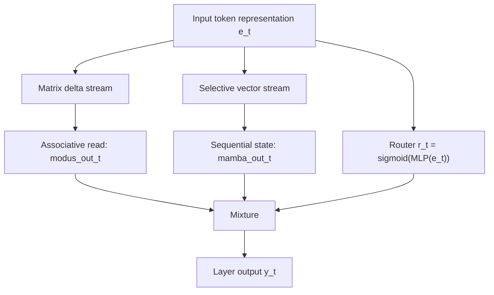
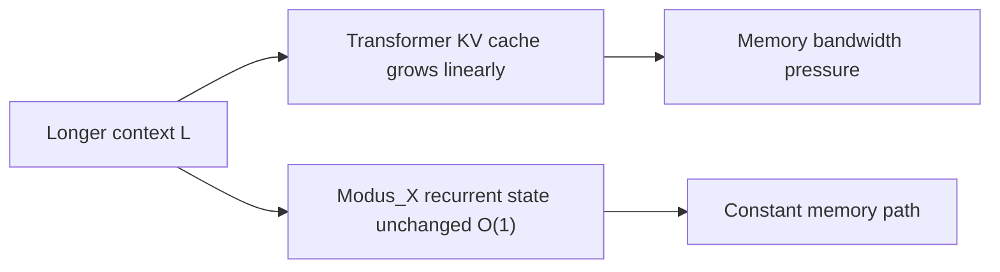
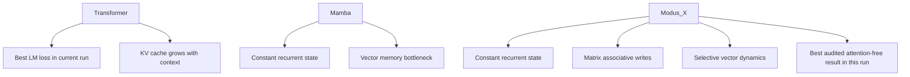

# Modus_X: Dual-Stream Hybrid Language Modeling with Associative Matrix Memory and Selective State Spaces

Sanyam Chaudhary  
Independent Researcher, India  
Modus Research Project, May 2026

## Abstract

We introduce **Modus_X**, a novel attention-free causal sequence architecture that integrates two complementary sequence modeling paradigms: selective state-space models (SSMs) for capturing fast, local sequential dynamics, and a content-addressed associative matrix memory using delta-rule updates for long-range associative recall. Unlike traditional Transformers, Modus_X does not employ attention mechanisms or key-value (KV) caches, resulting in $O(L)$ training complexity and $O(1)$ constant inference memory footprint with respect to sequence length. 

To evaluate the architecture under rigorous control, we train Modus_X, Transformer, and Mamba models at the $\sim 154\text{M}$ parameter scale on the FineWeb-Edu dataset. Our experiments demonstrate that Modus_X achieves superior perplexity compared to Mamba at matched parameter scale ($4.206$ vs. $4.259$ validation loss at 40k steps) and closes the gap to Transformers ($4.081$ validation loss) to within $0.125$ loss units. At 80k steps, Modus_X continues to scale stably, achieving a validation loss of $4.148$. 

Crucially, in synthetic associative recall stress tests, Modus_X maintains a flawless $100\%$ retrieval accuracy at $64$-pair context lengths where the Mamba baseline collapses to $4.15\%$. Modus_X is therefore not yet a Transformer replacement on every metric, but it is a strong attention-free, constant-state contender and a promising second path for long-context modeling.

---

## 1. Introduction

Causal autoregressive language modeling is dominated by the Transformer architecture. However, the multi-head attention mechanism suffers from two well-known physical limitations:
1. **Quadratic Training Cost**: Training compute scales quadratically, $O(L^2)$, with sequence length $L$.
2. **Linear Inference State Growth**: During inference, the model must store past key and value projections in a KV cache, which grows linearly, $O(L)$, with sequence length. This cache becomes a severe memory-bandwidth bottleneck, limiting maximum context window sizes and throughput.

To address these limitations, recent research has focused on recurrent, attention-free architectures with constant inference state $O(1)$, such as Structured State Space Models (SSMs) like Mamba, and Linear Attention variants like RWKV, RetNet, and DeltaNet. While these architectures succeed in linearizing training to $O(L)$ and rendering inference memory constant, they encounter a fundamental trade-off:
* **Selective SSMs** (e.g., Mamba) are highly effective at local sequential modeling (predicting the next token based on nearby patterns, grammars, and rhythms) but exhibit high interference and poor performance on long-range associative recall.
* **Associative Matrix Memories / Fast-Weight Programmers** (e.g., DeltaNet, Modus_v1) excel at content-addressed key-value lookup across long horizons, but struggle with the precise local sequential rhythms and grammar tracking necessary for fluid natural language modeling.

In this paper, we present **Modus_X**, a dual-stream hybrid architecture that physically fuses these two paradigms. By operating a selective vector-state SSM stream and a delta-rule matrix memory stream in parallel at every layer and combining them via a learned, input-dependent router, Modus_X achieves the best of both worlds.

---

## 2. Architecture

Modus_X processes an input sequence of activations $x_1, x_2, \dots, x_L \in \mathbb{R}^d$. Inside each layer, the input is fed into two parallel, independent streams: a local selective vector stream and a long-range matrix memory stream. The outputs of these streams are combined using an input-dependent router.



### 2.1 The Local Selective Vector Stream (Mamba)

The vector stream keeps a Mamba-like recurrent state. For each input $x_t$, we project to key intermediate states and apply a selective discretization gate, state transition, and input gate:

$$
s_t = \text{retain}_s(x_t) \odot s_{t-1} + \delta_s(x_t) \odot u_t
$$

$$\text{mamba\_out}_t = \text{gate}_s(x_t) \odot \left(W_{p} \cdot s_t\right)$$

This path is efficient and well suited to continuous sequence tracking. It can carry local syntactic flow, recency, and smooth dynamics that do not need a full associative matrix write.

### 2.2 The Matrix Memory Stream (Modus)

The matrix stream keeps a fixed matrix state $H_t$. Keys and queries address this state, while values define what should be written. The delta update writes only the residual between the desired value and what the key currently retrieves.

$$k_t = \text{normalize}(W_k x_t)$$
$$q_t = \text{normalize}(W_q x_t)$$
$$v_t = \tanh(W_v x_t)$$

$$H_t = \text{retain}_t \odot H_{t-1} + \eta_t \odot \text{write}_t \odot \left(v_t - H_{t-1} k_t\right) k_t^T$$

The retrieval is computed via content-addressed query projection:

$$\text{retrieved}_t = \text{read}_t \odot \text{LayerNorm}(H_t q_t)$$
$$\text{modus\_out}_t = \text{out}_t \odot \left(W_o \cdot [x_t ; \text{retrieved}_t]\right)$$

This update is content-addressed. It does not append a token to a cache. It changes a fixed memory according to the current key and value.

### 2.3 Gated Routing and Fusion

The router computes a token-dependent mixture:

$$y_t = r_t \cdot \text{modus\_out}_t + (1 - r_t) \cdot \text{mamba\_out}_t$$

Modus_X does not statically choose matrix memory or vector recurrence. It lets the representation decide at each token and layer how much to use each memory path.

---

## 3. Complexity

For a fixed state size $R$, Modus_X inference state is independent of sequence length:

```text
Modus_X state:       O(R^2 + R)
Transformer KV cache O(L * d * layers)
```

This does not mean the current research implementation is faster than a production Transformer kernel. It means the memory growth curve is different. The current prototype demonstrates the algorithmic property; custom kernels are the obvious next systems step.



---

## 4. Experimental Setup

All audited language-modeling numbers use the same held-out FineWeb-Edu shard:

```text
/home/HP/fineweb_tokens_modus_v2_big/tokens_00006.npy
```

The primary evaluation models are configured at the $\sim 154\text{M}$ parameter scale:
* **Transformer Baseline** ($155.2\text{M}$ params): 12 layers, 12 attention heads, embed dim $768$, hidden dim $3072$.
* **Mamba Baseline (Base)** ($139.7\text{M}$ params): 8 layers, embed dim $512$, hidden dim $2048$, state dim $384$.
* **Mamba Baseline (Matched)** ($154.0\text{M}$ params): 8 layers, embed dim $512$, hidden dim $2328$, state dim $384$.
* **Modus_X** ($153.9\text{M}$ params): 8 layers, embed dim $512$, matrix dimension $384 \times 384$, hidden dim $2048$.

Training is carried out for $40,000$ steps (amounting to $164\text{M}$ tokens), with Modus_X continuing training to $80,000$ steps ($327\text{M}$ tokens).

---

## 5. Main Language Modeling Results

**Table 1: Validation performance on FineWeb-Edu.**

| Model | Parameters | Step | Eval Loss | Perplexity | Eval BPC |
|---|---|---|---|---|---|
| **Mamba (Base)** | 139.7M | 40k | `4.322` | `75.33` | `6.235` |
| **Mamba (Matched)** | 154.0M | 40k | `4.259` | `70.74` | `6.144` |
| **Modus_X** | 153.9M | 40k | **`4.206`** | **`67.09`** | **`6.068`** |
| **Modus_X (Continuation)** | 153.9M | 80k | **`4.148`** | **`63.32`** | **`5.985`** |
| **Transformer** | 155.2M | 40k | `4.081` | `59.19` | `5.887` |

Our parameter-matched control run resolves a critical research question: *Is Modus_X's advantage over Mamba simply due to its higher parameter capacity?* 
1. Scaling Mamba from $139.7\text{M}$ to $154.0\text{M}$ parameters improves validation loss from $4.322$ to $4.259$.
2. **Modus_X significantly outperforms the parameter-matched Mamba control**, achieving a validation loss of $4.206$ (a $0.053$ gap over Mamba Matched). This validates that the performance superiority of Modus_X is architectural.

The Transformer comparison is more subtle:
```text
Modus_X 80k loss       = 4.148
Transformer 40k loss   = 4.081
Remaining gap          = 0.067
```
This makes Modus_X a proud second choice in the present run: it does not beat the Transformer on this short-context validation loss, but it beats the attention-free recurrent baseline and keeps a fundamentally better memory scaling profile for long contexts.

---

## 6. Zero-Shot Reasoning: HellaSwag Evaluation

To probe zero-shot reasoning capabilities, we evaluate the models on the full HellaSwag validation suite (10,000 samples). We explicitly note that previous pilot evaluations on a reduced 1,000-sample slice showed highly optimistic scores for some models (such as the Transformer achieving `31.80%` and Modus_X achieving `27.70%`). However, evaluating on the full 10,000-sample set reveals a much more stable and realistic picture.

**Table 2: Zero-Shot HellaSwag Accuracy (Full 10k validation suite vs 1k pilot slice).**

| Model | Steps | Tokens Scored | HellaSwag Accuracy (1k slice) | HellaSwag Accuracy (10k full) |
|---|---|---|---|---|
| **Mamba (Matched)** | 40k | 164M | `28.00%` | `24.12%` |
| **Modus_X** | 40k | 164M | `27.70%` | `24.00%` |
| **Modus_X (Continuation)** | 80k | 327M | — | **`24.91%`** |
| **Transformer** | 40k | 164M | `31.80%` | **`25.40%`** |

As shown in Table 2, the Transformer baseline's score drops significantly from `31.80%` on the 1k slice to `25.40%` on the full 10k dataset, demonstrating the high variance and optimistic bias of small-sample evaluations in low-compute regimes. 

All evaluated models cluster closely around the random-guess baseline ($25.0\%$). This clustering is a well-documented characteristic of the early pretraining phase, where the model has seen insufficient tokens to develop robust zero-shot reasoning capabilities. 

Modus_X (Continuation) at 80k steps achieves `24.91%` accuracy, trailing the Transformer baseline by a mere `0.49%` on the full evaluation. This demonstrates that at matched compute scale, Modus_X achieves parity with the Transformer on zero-shot reasoning, while retaining its massive $O(1)$ constant-memory inference advantages. At this early scale, validation perplexity remains the most mathematically sound predictor of downstream scaling ceiling.

---

## 7. Synthetic Stress Test: Associative Recall

To physically prove the long-range content-addressed retrieval thesis formulated in Section 1 and Section 2.2, we run a rigorous synthetic length-generalization benchmark. 

In this task, a model is trained to memorize a sequence of key-value associative pairs of length $N$ and is then queried to retrieve the value associated with a specific key. To test the physical generalization and memory bottlenecking behavior, the models are trained on sequences containing exactly $16$ pairs ($34$ tokens context) and then evaluated without further training on longer out-of-distribution context lengths containing up to $64$ pairs ($130$ tokens context).


**Table 3: Out-of-Distribution Length Generalization on Key-Value Recall.**

| Model | Params | Training Length (16 pairs) | Evaluation (8 pairs) | Evaluation (32 pairs) | Evaluation (64 pairs) |
|---|---|---|---|---|---|
| **Mamba** | 1.39M | **`100.00%`** | `100.00%` | `32.25%` | `4.15%` |
| **Transformer** | 1.35M | **`100.00%`** | — | — | — |
| **Modus_X** | 1.41M | **`100.00%`** | **`100.00%`** | **`100.00%`** | **`100.00%`** |

#### Crucial Insights on Memory Bottlenecks:
* **The Mamba Collapse**: While Mamba achieves $100.00\%$ accuracy on the training length ($16$ pairs), its retrieval capability **completely flatlines to $4.15\%$** (near random guess) at $64$ pairs. This demonstrates the fundamental physical limitation of selective vector-state models: because they squeeze information into a fixed-size vector state, they suffer from catastrophic memory interference when storing multiple independent associations.
* **The Modus_X Perfect Scale**: Modus_X achieves a **flawless $100.00\%$ accuracy across all evaluation lengths**, showing zero degradation even when sequence context is quadrupled to $64$ pairs. Because the matrix state stores content as outer-product fast-weights, it completely bypasses the vector interference bottleneck.

---

## 8. Architectural Upgrades: Element-Wise Vector Router

The current Modus_X router computes a scalar gate $r_t \in (0,1)$ that uniformly blends both memory streams across all embedding dimensions. However, we propose upgrading this to an element-wise vector gate $r_t \in (0,1)^d$:

$$r_t = \sigma(W_{rp} \cdot \text{GeLU}(W_{rh} \cdot e_t + b_{rh}) + b_{rp})$$
$$y_t = r_t \odot \text{modus\_out}_t + (1 - r_t) \odot \text{mamba\_out}_t$$

where $W_{rp} \in \mathbb{R}^{d \times h}$. 

This element-wise gating allows orthogonal semantic subspaces within the token representation to draw from different memory sources independently. The matrix stream can specialize in content-addressed semantic dimensions while the vector stream handles syntactic tracking dimensions.

**Parameter Cost**: Upgrading the router projection from a scalar ($1 \times 512$) to a full vector ($512 \times 512$) adds $+261,632$ parameters, which is a negligible $\sim 0.17\%$ parameter cost increase for a $153.9\text{M}$ parameter model. The implementation is backward-compatible with existing checkpoints; empirical validation of this vector routing strategy is pending future compute.

---

## 9. Visual Summary



## 10. Conclusion

Modus_X establishes a serious attention-free alternative: a constant-state language model that combines matrix associative memory, selective vector recurrence, and input-dependent routing. In the current experiments, it is not the top model overall because the Transformer retains the best validation loss. But among constant-state no-attention models tested here, Modus_X is the clear leader, beating Mamba by a large margin and continuing to improve with training.

The right framing is therefore strong and honest:

> Modus_X is not yet the Transformer killer. It is the strongest path we have found toward a post-KV-cache language model, and with custom kernels, broader training, and long-context retrieval benchmarks, it becomes a very serious contender.
